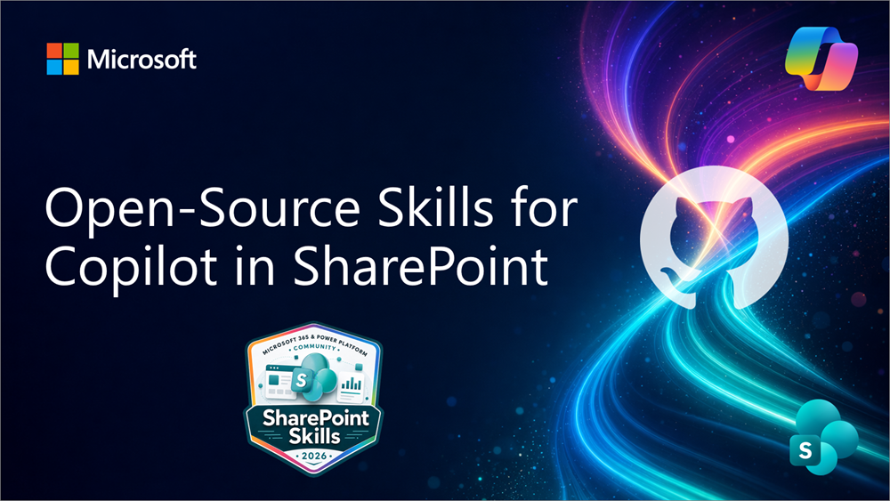

# SharePoint Skills

A curated library of AI skills for the latest AI features in Microsoft 365 SharePoint.

> **Status:** Active — new content added regularly.

**[Browse the SharePoint Skills gallery](https://pnp.github.io/sharepoint-skills/)**

## Watch the Overview

---

## What's Inside

- [`Skills/`](./Skills/): AI skills — each skill in its own folder, ready to install into a SharePoint agent

---

## Prerequisites

- A SharePoint site where Copilot in SharePoint is available
- An active **Microsoft Copilot license**
- **Edit** permission on the site to add a skill, or **View** permission to run one

## Get Started

A SharePoint skill packages reusable instructions that help Copilot perform a focused, repeatable task on a site.

1. **Start with the gallery:** Browse the **[SharePoint Skills gallery](https://pnp.github.io/sharepoint-skills/)** for the easiest way to see what is available and choose a skill for your task.
2. **Review the skill:** Open its outer `README.md` to see what it does, what it produces, and any setup or demo guidance.
3. **Install it:** Upload the skill's same-name inner package folder, containing `SKILL.md`, to the **Skills** folder in your site's **Agent Assets** library.
4. **Run it:** Open Copilot in SharePoint and ask for the task in your own words, or invoke the skill by name. Look for the skill indicator in chat to confirm that it loaded.

See [Installing a Skill](./Skills/README.md#installing-a-skill) for detailed steps, or use the [troubleshooting guide](./Skills/TROUBLESHOOTING.md) if Copilot does not recognize the skill.

For broader rollout planning, see the [Copilot in SharePoint adoption guidance](https://aka.ms/CopilotinSP).

---

## Contributing

Contributions and corrections are welcome! See the **[Contribution guide](./CONTRIBUTING.md)** for the full process — skill folder structure, naming conventions, required files, file templates (including `sample.json`), and the pre-submission checklist.

Participation is governed by the [Code of Conduct](./CODE_OF_CONDUCT.md). Report suspected security concerns according to the [Security Policy](./SECURITY.md).

All contributors on this repository will be acknowledged with special [SharePoint Skills Credly badge](https://www.credly.com/org/m365pnp/badge/sharepoint-skills-microsoft-365-power-platform-comm).

Notice that you'll need to register to this the community contribution program once if you have not done that yet. See more from our [Community Recognition Program](https://aka.ms/community/recognition).

---

## License

[MIT](./LICENSE) © 2026 [pnp](https://github.com/pnp)

---

## Disclaimer

These skills are provided as-is for learning and experimentation. They are not official Microsoft documentation. Always verify against the latest [Microsoft Learn](https://learn.microsoft.com) docs before deploying to production.
