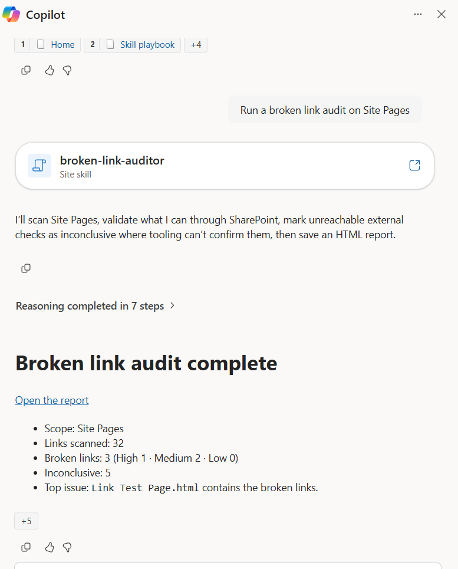
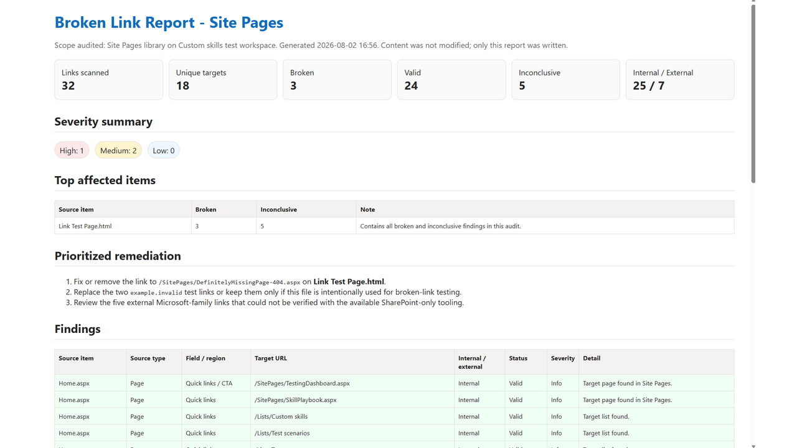

# Broken Link Auditor

Scans SharePoint pages, news posts, and hyperlink fields for broken or risky links and saves a self-contained HTML link-health report to the site. It stays read-only for content and only writes the final report file.

**Skill invoked in Copilot in SharePoint:**

**Generated HTML report:**

## What you get

- A link-health summary with total links scanned, broken link count, internal vs external split, and inconclusive checks
- A severity-ranked findings list for missing SharePoint targets, dead external URLs, malformed links, redirects, and permission-limited checks
- A color-coded HTML report with per-item findings, status details, and a prioritized remediation section
- The report saved to a `Link Reports` folder with a clear timestamped filename
- Strictly read-only behavior for pages, files, lists, and links

## When to use

Ask Copilot:

- *"broken link audit"* / *"find broken links"*
- *"check dead links on this site"*
- *"audit links in this library"*
- *"scan pages for broken links"*
- *"which SharePoint links are broken"*

Use it before a site launch, migration, handover, or content governance review when you need a defensible snapshot of link health without editing anything.

## Prerequisites

- A SharePoint site with pages, news posts, lists, libraries, or selected items in scope
- Read access to the scoped content
- Permission to create the HTML report file in a document library on the current site

## SharePoint Skill

| Solution | Author(s) |
| --- | --- |
| broken-link-auditor | Valeras Narbutas &#124; [GitHub](https://github.com/ValerasNarbutas) |

## Version history

| Version | Date | Comments |
| --- | --- | --- |
| 1.0 | August 2026 | Initial Release |

## Disclaimer

**THIS CODE IS PROVIDED _AS IS_ WITHOUT WARRANTY OF ANY KIND, EITHER EXPRESS OR IMPLIED, INCLUDING ANY IMPLIED WARRANTIES OF FITNESS FOR A PARTICULAR PURPOSE, MERCHANTABILITY, OR NON-INFRINGEMENT.**

