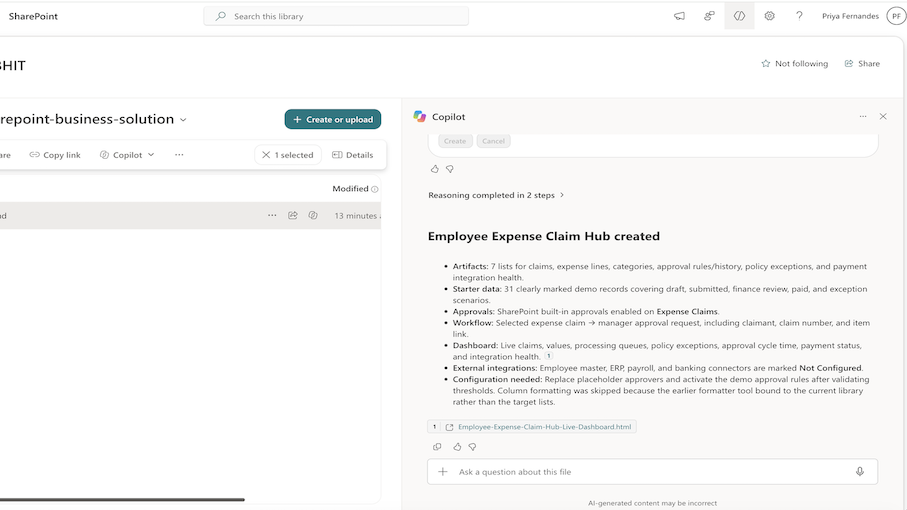

# Build SharePoint Business Solution

Turns a functional brief into a deployed SharePoint solution rather than architecture advice. Inventories the site, designs and creates a normalized set of lists and libraries, configures native approvals and workflows, seeds clearly labelled demo data, generates a live HTML dashboard in the `Reports` library, and verifies the whole deployment end to end.

## What you get

- A site inventory taken before anything is created, so compatible existing lists and libraries are reused instead of duplicated
- A normalized data model: primary transaction list, child/detail list, approval rules, approval/audit log, reference lists, integration status, and optional assistant history — each with a renamed `Title`, a purpose description, and a practical default view
- Artifacts created in dependency order, with verified internal names and no calculated fields or unsupported validation formulas
- Native SharePoint approvals enabled on the primary list, without duplicating `_ApprovalStatus` and without fabricated default approvers
- Workflows built only from live triggers, tasks, and parameter options retrieved from the tenant — never guessed IDs, mailboxes, or connections
- Safe starter data covering draft, pending, approved, closed, and exception states, prefixed `DEMO-` with sample rules left inactive and external connectors marked `Not Configured`
- A live HTML dashboard saved to `Reports`, with KPI cards, grouped breakdowns, an operational queue table, an integration-health panel, and a visible refresh control
- End-to-end verification before completion: rediscovery for duplicates, schema retrieval, approval state, demo item counts, and confirmation that the dashboard file exists
- An explicit limitations report covering unresolved approvers, inactive rules, skipped formatting, and unconfigured connectors

## When to use

Ask Copilot any of the following (or close variations):

- *"build an end to end SharePoint solution"*
- *"create lists, approvals and a live dashboard"*
- *"turn this business process into a SharePoint app backend"*
- *"build a SharePoint solution for requests"*
- *"create my feature end to end"*

Works across structured business processes — procurement, HR, service intake, projects, compliance, facilities, finance, onboarding, and case management. Best on a site where you can create lists, libraries, and workflows. Not intended for a single list edit, one file operation, or non-SharePoint automation.

## SharePoint Skill

| Solution | Author(s) |
| --- | --- |
| build-sharepoint-business-solution | Priya Fernandes | [GitHub](https://github.com/Ms-fernandes) | [LinkedIn](https://www.linkedin.com/in/priyafernandes/) |

## Version history

| Version | Date | Comments |
| --- | --- | --- |
| 1.0 | September 2026 | Initial Release |

## Disclaimer

**THIS CODE IS PROVIDED _AS IS_ WITHOUT WARRANTY OF ANY KIND, EITHER EXPRESS OR IMPLIED, INCLUDING ANY IMPLIED WARRANTIES OF FITNESS FOR A PARTICULAR PURPOSE, MERCHANTABILITY, OR NON-INFRINGEMENT.**

