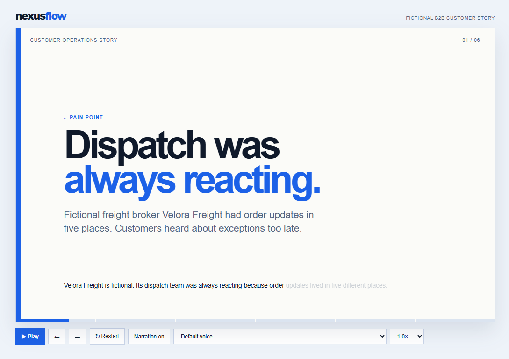

# Campaign Story

Turns a product narrative, customer case, launch, or operational transformation into a self-contained animated HTML campaign story. Uses the NexusFlow premium B2B application design with short narrated scenes, playback controls, a voice picker, motion-driven action cards, and a confetti finale.

## What you get

- A one-minute, 5–6 scene campaign arc (pain, three improvement moments, measurable outcome, payoff and CTA)
- A single self-contained `.html` file with no CDNs, fonts, or external libraries
- Playback controls for play/pause, previous, next, restart, narration, voice, and speed
- Word-by-word captions synchronized with browser `speechSynthesis`
- Motion that respects `prefers-reduced-motion`
- Output saved to the site’s Reports library
- A clear fictional-data label when the story is a sample rather than source-backed

## When to use

Ask Copilot:

- *"create a campaign story"*
- *"make a one-minute customer story"*
- *"turn this case study into a campaign animation"*
- *"create an animated product campaign"*
- *"make a premium B2B story demo"*

Works from a source document, a named file on the site, or a brief. If no source is provided, the skill builds a labelled fictional sample.

## SharePoint Skill

| Solution | Author(s) |
| --- | --- |
| campaign-story | Anand Ragavan &#124; [GitHub](https://github.com/anandragav) &#124; [LinkedIn](https://www.linkedin.com/in/anand-vijayaragavan-89443012/) |

## Version history

| Version | Date | Comments |
| --- | --- | --- |
| 1.0 | September 2026 | Initial Release |

## Disclaimer

**THIS CODE IS PROVIDED _AS IS_ WITHOUT WARRANTY OF ANY KIND, EITHER EXPRESS OR IMPLIED, INCLUDING ANY IMPLIED WARRANTIES OF FITNESS FOR A PARTICULAR PURPOSE, MERCHANTABILITY, OR NON-INFRINGEMENT.**

