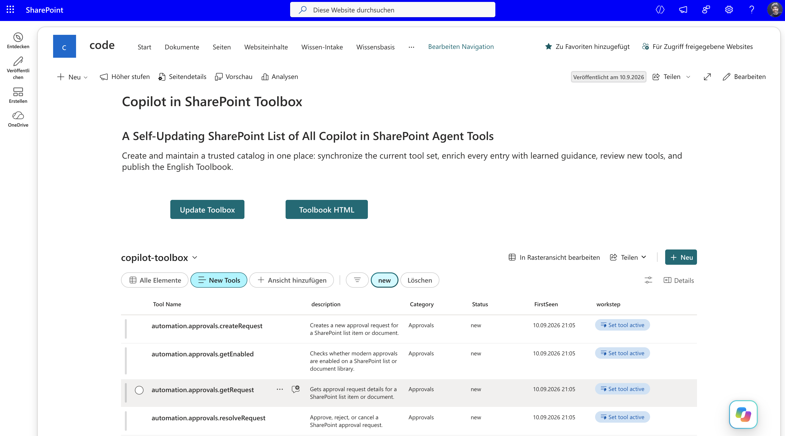

# Copilot Toolbox

Creates and maintains a SharePoint-based toolbox for discovering, documenting, reviewing, and synchronizing the tools available to Copilot in SharePoint.

## What you get

- A SharePoint list named `copilot-toolbox` that acts as a local handbook for Copilot tools.
- Automatic discovery and synchronization of the current Copilot tool catalog.
- Enriched tool records with usage guidance, parameters, examples, prompts, categories, and lifecycle status.
- A `New Tools` review view and `Set tool active` Quick Step.
- A SharePoint page named `Toolbox.aspx`.
- An optional English HTML Toolbook named `copilot-toolbook-en.html`.
- Safe repair and resume behavior after interrupted or incomplete runs.

## SharePoint Skill

| Solution | Author(s) |
| --- | --- |
| copilot-toolbox | Michael Greth &#124; [GitHub](https://github.com/mysharepoint) &#124; [LinkedIn](https://www.linkedin.com/in/mgreth/) |

## Version history

| Version | Date | Comments |
| --- | --- | --- |
| 1.0 | September 2026 | Initial Release |

## Installation

1. Open the target SharePoint site.
2. Upload the complete inner `copilot-toolbox` folder to:

   `Agent Assets / Skills / copilot-toolbox`

3. Start a new Copilot conversation on the site.
4. Ask Copilot:

   > Install the toolbox and import all tools.

On first use, the skill creates the required SharePoint artifacts and imports the current tool catalog after the enrichment checks pass.

On later runs, it synchronizes and repairs the existing toolbox without recreating valid artifacts.

## What the skill does

The `copilot-toolbox` skill:

- creates the English `copilot-toolbox` SharePoint list when it does not exist;
- creates the required schema, the `New Tools` review view, the `Set tool active` Quick Step, and `Toolbox.aspx`;
- imports and synchronizes the complete current Copilot tool catalog;
- calls `learn_tool` for every current tool, including direct tools, before planning tool-record writes;
- stores the original short catalog description in `description`;
- stores detailed learned guidance in `UseCase`;
- stores exact learned inputs and their verified meaning in `KeyParameters`;
- blocks tool-record writes until every current tool passes the enrichment checks;
- repairs incomplete current-tool rows;
- resumes safely after timeouts, parser failures, expired confirmations, interrupted runs, and ambiguous write outcomes;
- creates only missing rows and updates only incomplete rows;
- tracks `new`, `active`, `archived`, `removed`, and returning tools;
- publishes one standalone English handbook named `copilot-toolbook-en.html`;
- never modifies or replaces `Home.aspx`.

## Regular synchronization and repair

Ask Copilot:

> Synchronize the Copilot Toolbox and fully enrich every current tool.

The skill reads the current list, learns every current tool, validates planned changes, repairs incomplete records, adds newly detected tools with status `new`, reactivates returning tools, and marks proven missing tools as `removed`.

## Enrichment transaction gate

Before any tool-record create or update, the skill verifies that:

- `UseCase` contains `When to invoke`, `When not to invoke`, and `Usage notes`;
- learned exclusions, prerequisites, sequencing, limits, and constraints are retained;
- `KeyParameters` contains every exact learned parameter name and a verified meaning;
- `Category` uses the most specific verified family;
- `Example` and `PromptTemplate` are capability-specific;
- no managed field contains placeholder or generic fallback text.

If these checks fail, the skill does not write incomplete tool records.

## Failure recovery

After a timeout, parser error, expired confirmation, interrupted execution, or unknown write result, the skill:

1. reads the managed fields again;
2. classifies each authoritative tool as verified, missing, incomplete, or duplicate;
3. preserves verified rows and reviewed lifecycle state;
4. creates only missing rows;
5. updates only incomplete rows from retained learned definitions;
6. avoids repeating writes whose intended state is already present.

## Toolbox.aspx button configuration

Both required controls must use SharePoint **Button** web parts.

| Button | Action | Prompt |
| --- | --- | --- |
| `Update Toolbox` | `Copilot in SharePoint` | `Synchronize the Copilot Toolbox and fully enrich every current tool.` |
| `Toolbook HTML` | `Copilot in SharePoint` | `Create or refresh copilot-toolbook-en.html in this site's standard document library.` |

A button configured as `Link` instead of `Copilot in SharePoint` is not a valid installation.

## Publish the Toolbook

Ask Copilot:

> Create or refresh copilot-toolbook-en.html in this site's standard document library.

The skill resolves the site's standard document library at runtime and saves `copilot-toolbook-en.html` at the library root.

The Toolbook includes `new`, `active`, and `archived` tools and excludes `removed` tools by default.

## Review workflow

Newly detected tools receive status `new`.

Review them in the `New Tools` view and use the `Set tool active` Quick Step to change reviewed records to `active`.

An `active` status does not exempt a row from later quality checks.

## Expected artifacts

- SharePoint list: `copilot-toolbox`
- View: `New Tools`
- Quick Step: `Set tool active`
- SharePoint page: `Toolbox.aspx`
- English handbook: `copilot-toolbook-en.html`

## Verification checklist

After installation or synchronization, verify that:

- every current authoritative tool identity exists exactly once;
- every current tool was processed through `learn_tool`;
- `description` keeps the original short catalog text;
- `UseCase` contains tool-specific learned invocation guidance and constraints;
- `KeyParameters` contains exact input names and verified meanings;
- no row contains generic filler or placeholder text;
- the `New Tools` view and `Set tool active` Quick Step work;
- `Toolbox.aspx` uses the `copilot-toolbox` list and `New Tools` view;
- `copilot-toolbook-en.html` exists in the resolved standard document library;
- `Home.aspx` remains unchanged.

## Disclaimer

**THIS CODE IS PROVIDED _AS IS_ WITHOUT WARRANTY OF ANY KIND, EITHER EXPRESS OR IMPLIED, INCLUDING ANY IMPLIED WARRANTIES OF FITNESS FOR A PARTICULAR PURPOSE, MERCHANTABILITY, OR NON-INFRINGEMENT.**

