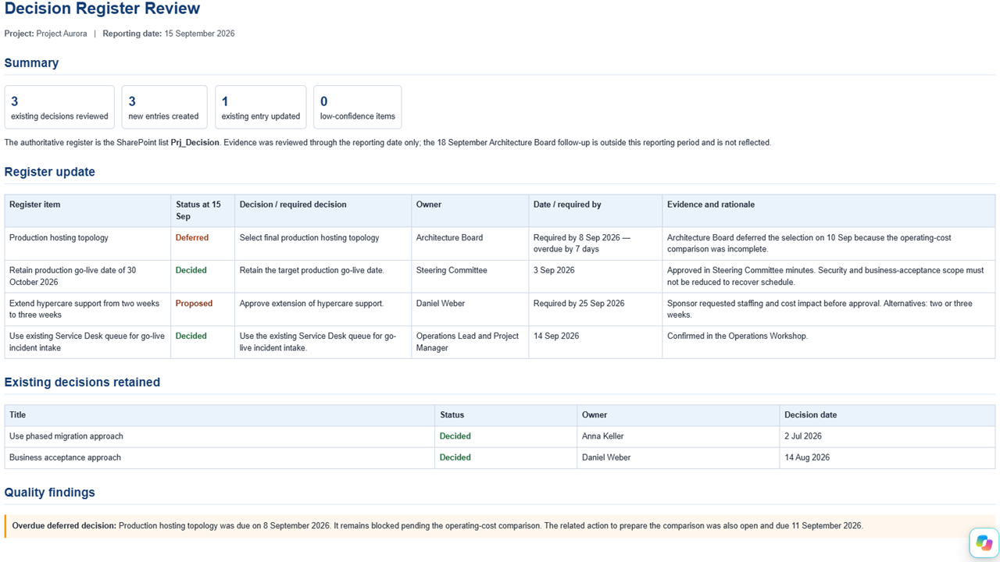

# Decision Register Builder

Analyze SharePoint project evidence, discover an existing structured Decision Register, and identify evidence-supported new decisions and updates.

## What you get

- Discovery of a SharePoint Decision Register even when the skill starts from a document-library context
- Classification of decisions as Open, Proposed, Decided, Deferred, Superseded, or Unknown
- Deduplication against existing register entries
- Evidence-based updates to existing decisions
- Separation of decisions from recommendations, discussions, actions, risks, and mitigation activities
- Reporting-date cut-off handling
- Optional standalone HTML5 decision-review report
- Synthetic Project Aurora demo with a repeatable two-stage test

## Try it

Install the inner `decision-register-builder` folder as the runtime skill.

Example:

> Review the Project Aurora content and build/update the Decision Register. Use 15 September 2026 as the reporting date. Create the final standalone HTML report.

See [`demo/DEMO-SETUP.md`](./demo/DEMO-SETUP.md) for the complete setup, list schemas, seed data, prompts, expected results, verification steps, second test, and troubleshooting.

## SharePoint Skill

| Solution | Author(s) |
| --- | --- |
| decision-register-builder | Marc Andre Schroeder-Zhou &#124; [GitHub](https://github.com/maschroeder-z) |

## Version history

| Version | Date | Comments |
| --- | --- | --- |
| 1.0 | September 2026 | Initial Release |

## Disclaimer

**THIS CODE IS PROVIDED _AS IS_ WITHOUT WARRANTY OF ANY KIND, EITHER EXPRESS OR IMPLIED, INCLUDING ANY IMPLIED WARRANTIES OF FITNESS FOR A PARTICULAR PURPOSE, MERCHANTABILITY, OR NON-INFRINGEMENT.**

