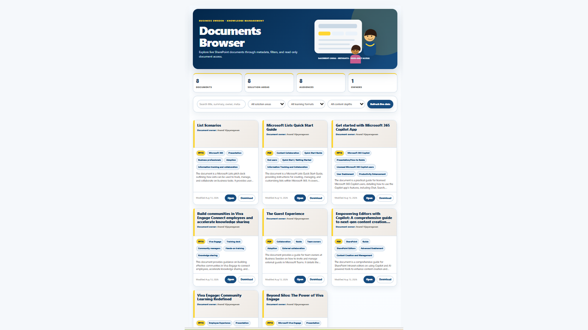

# Document Browser

Creates a professional live-linked document browser dashboard for a SharePoint document library. Uses real metadata fields, Knowledge Explorer header styling, a visible refresh control, reliable Open/Download links, and a clean 3-card desktop layout.

## What you get

- Live-linked dashboard that reflects new or updated documents after refresh (when supported)
- Knowledge Explorer-style header with navy, blue, yellow, and sand color system
- Exactly 3 document cards per desktop row (responsive to 2 then 1)
- Cards show Document Title, Document Owner below the title, abstract preview, metadata pills, and dates
- Search across title, filename, abstract, metadata, owner, and contacts
- Filters driven by real library fields (Practice, Service Area, Industry, Market, Regions, Document Type, Year, etc. when present)
- Robust SharePoint Open and Download links that work inside the HTML preview experience
- Visible “Refresh live data” control
- Fully self-contained HTML with no external dependencies beyond the live-data binding

## Good to know

- Document "Open" experience is designed to open with "embedview" experience. Sometimes Copilot does not produce it as written in Skill. Emphasize in chat to follow the skill strictly, that is if the "embedview" experience is what you are after.
- Thumbnails of documents is not supported yet, is what I figured.
- People pictures (person columns) of is not supported yet, is what I figured.
- Only supports on root folder in library.

## SharePoint Skill

| Solution | Author(s) |
| --- | --- |
| document-browser | Anand Ragavan &#124; [GitHub](https://github.com/anandragav) &#124; [LinkedIn](https://www.linkedin.com/in/anand-vijayaragavan-89443012/) |

## Version history

| Version | Date | Comments |
| --- | --- | --- |
| 1.0 | August 2026 | Initial Release |

## Disclaimer

**THIS CODE IS PROVIDED _AS IS_ WITHOUT WARRANTY OF ANY KIND, EITHER EXPRESS OR IMPLIED, INCLUDING ANY IMPLIED WARRANTIES OF FITNESS FOR A PARTICULAR PURPOSE, MERCHANTABILITY, OR NON-INFRINGEMENT.**

