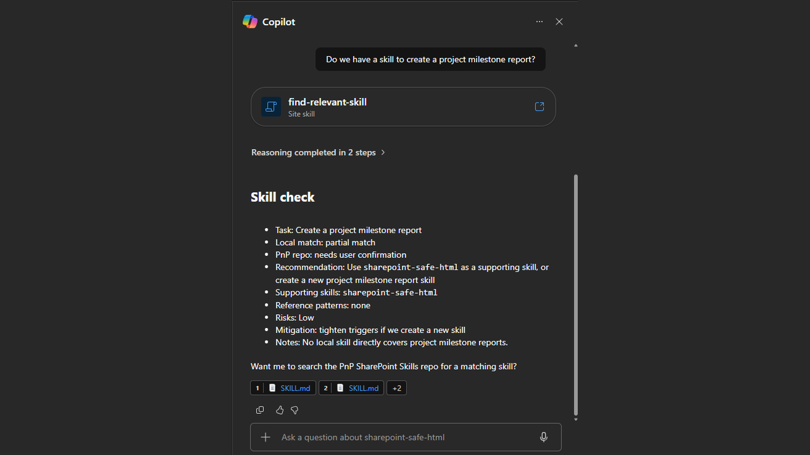

# Find Relevant Skill

`find-relevant-skill` is a meta-skill for SharePoint AI agents: before handling a recurring or site-specific request, it checks whether this site already has a local skill that covers it, and — only with explicit, per-request confirmation — offers to search the public [PnP SharePoint Skills](https://github.com/pnp/sharepoint-skills) repository for a reusable one. It then walks through a risk assessment before recommending that anything be installed, adapted, or referenced.

The goal is to stop agents from reinventing site-specific procedures that already exist — either locally or in the community catalog — while keeping any external repo access explicit and opt-in.

## What you get

- **Local-first discovery**: Checks skills already loaded or stored in this site's local skill library before looking anywhere else.
- **Explicit confirmation gate**: Never searches or accesses the public PnP repo without asking the user first, every time — prior approval in another turn doesn't carry over.
- **Tiered match evaluation**: Classifies any external findings as a direct match, a supporting match, a reference pattern, or no match, and recommends a different action for each.
- **Built-in risk review**: Screens any skill found externally for over-broad triggers, unsafe HTML, destructive actions without confirmation, fabricated SharePoint metadata, and other risk types, then rates it Low/Medium/High before recommending use.
- **No fabrication**: If a tool check fails or returns nothing, the skill says so rather than inventing site skills, paths, or repo contents.

## When to use

Ask things like:

- "Do we have a skill for this?"
- "Check site skills first"
- "Find a relevant skill"
- "Is there a local skill for this?"

It also self-triggers when a recurring or site-specific task comes up and no loaded or local skill obviously covers it. It's not meant to fire on one-off questions or small talk that don't call for a reusable procedure.

Best suited to any SharePoint site running an AI agent with its own local skill library, where you want the agent to check for — and safely reuse — existing procedures before improvising or building something new from scratch.

## Demo content

This skill has no bundled demo files — it operates on whatever local skills and PnP repo content already exist for your site, so there's nothing meaningful to ship as a static sample.

## SharePoint Skill

| Solution | Author(s) |
| --- | --- |
| find-relevant-skill | James Dellow (WebVine) &#124; [GitHub](https://github.com/jamesdellowwv) |

## Version history

| Version | Date | Comments |
| --- | --- | --- |
| 1.0 | August 2026 | Initial Release |

## Disclaimer

**THIS CODE IS PROVIDED _AS IS_ WITHOUT WARRANTY OF ANY KIND, EITHER EXPRESS OR IMPLIED, INCLUDING ANY IMPLIED WARRANTIES OF FITNESS FOR A PARTICULAR PURPOSE, MERCHANTABILITY, OR NON-INFRINGEMENT.**

