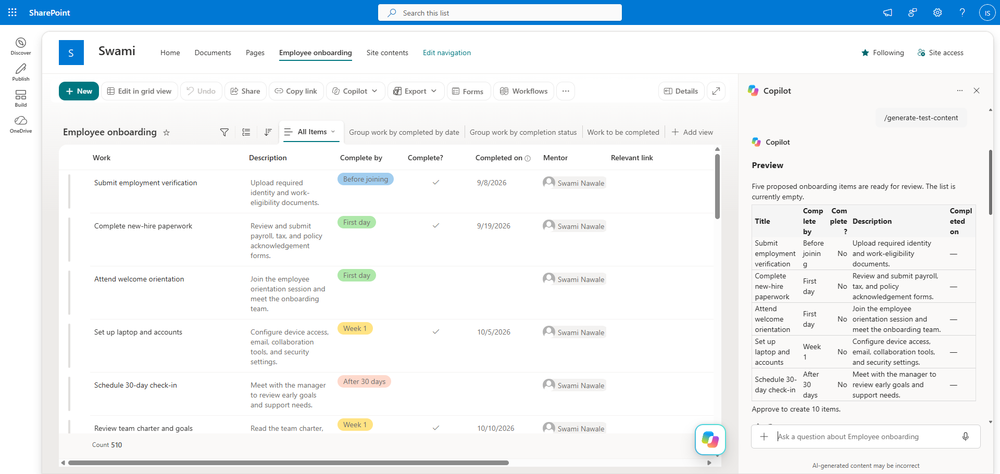

# Generate Test Content

Generates realistic test content for SharePoint lists and document libraries. Inspects the current list or library structure, previews five proposed items, and creates the requested number (default: 10) after approval.

## What you get

- Automatic detection of whether the current location is a list or a document library
- Dummy content that matches the real column schema, field types, and choices of a list — or realistic Word, Excel, PowerPoint, PDF, or other requested document formats for a library
- A five-item preview table shown for approval before anything is created
- Creation of the approved count (your requested number, or 10 by default) after you approve
- A verified completion summary with an inventory of what was created

## When to use

Ask Copilot:

- *"add test data"*
- *"create dummy data"*
- *"populate this list with sample items"*
- *"create dummy documents"*
- *"add sample records to this SharePoint list"*

Works on any SharePoint list or document library open in the current context.

## SharePoint Skill

| Solution | Author(s) |
| --- | --- |
| generate-test-content | Swami Nawale &#124; [GitHub](https://github.com/swaminawale) &#124; [LinkedIn](https://www.linkedin.com/in/swaminawale/) |

## Version history

| Version | Date | Comments |
| --- | --- | --- |
| 1.0 | October 2026 | Initial Release |

## Disclaimer

**THIS CODE IS PROVIDED _AS IS_ WITHOUT WARRANTY OF ANY KIND, EITHER EXPRESS OR IMPLIED, INCLUDING ANY IMPLIED WARRANTIES OF FITNESS FOR A PARTICULAR PURPOSE, MERCHANTABILITY, OR NON-INFRINGEMENT.**

