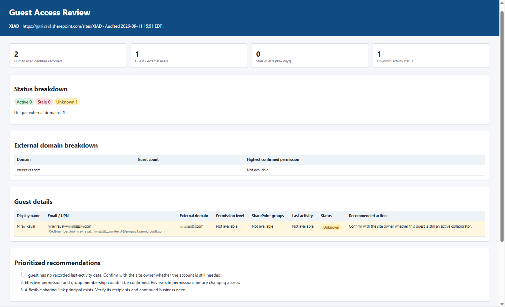

# Guest Access Reviewer

Enumerates every guest and external user who has access to the current SharePoint site, maps their permission levels, and flags stale accounts for review. Saves a color-coded, self-contained HTML report the site owner or governance team can act on — without modifying any permissions or content.

## What you get

- A full list of all guest and external users with site access, including their display name, email, domain, permission level, and SharePoint group membership
- Status classification for each guest: **Active** (activity within 90 days), **Stale** (no activity in 90+ days), or **Unknown** (no activity data available)
- A domain breakdown table showing which external organizations have the most representation on the site
- A prioritized recommendations section calling out stale accounts, elevated-permission guests, and accounts with no activity data
- A color-coded, self-contained HTML report saved to the site with a timestamped filename
- Strictly read-only behavior — no users are removed, no permissions are changed, no content is altered

## When to use

Ask Copilot:

- "guest access review" / "audit external users"
- "who has guest access on this site"
- "find stale guests" / "review external sharing"
- "which guests haven't been active recently"
- "external user audit" / "check guest accounts"

Use it during periodic access reviews, after a project or vendor engagement ends, before a site migration, or as part of a security and compliance review when you need a defensible snapshot of external access without touching anything.

## Prerequisites

- A SharePoint site with at least one guest or external user
- Read access to site user information and permission data
- Permission to create the HTML report file in a document library on the current site

## SharePoint Skill

| Solution | Author(s) |
| --- | --- |
| guest-access-reviewer | Nirav Raval &#124; [GitHub](https://github.com/nirav-raval) &#124; [LinkedIn](https://www.linkedin.com/in/nirav-raval/) |

## Version history

| Version | Date | Comments |
| --- | --- | --- |
| 1.0 | September 2026 | Initial Release |

## Disclaimer

**THIS CODE IS PROVIDED _AS IS_ WITHOUT WARRANTY OF ANY KIND, EITHER EXPRESS OR IMPLIED, INCLUDING ANY IMPLIED WARRANTIES OF FITNESS FOR A PARTICULAR PURPOSE, MERCHANTABILITY, OR NON-INFRINGEMENT.**

