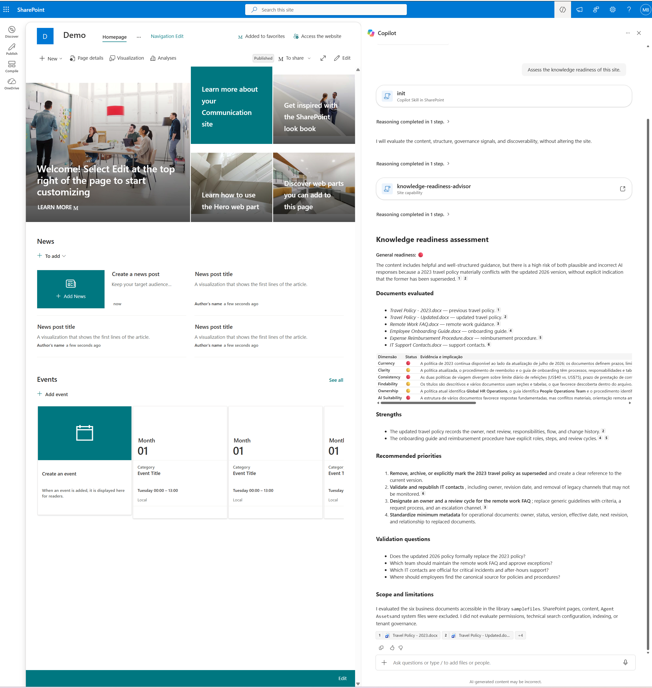

# Knowledge Readiness Advisor

Performs an executive Knowledge Management and Copilot Readiness assessment of business documents stored in SharePoint.

The skill evaluates accessible business content across exactly six dimensions: **Currency, Clarity, Consistency, Findability, Ownership, and AI Suitability**. It identifies evidence-based strengths, material risks, prioritized improvements, and questions for an initial client workshop.



## What you get

* Automatic discovery of relevant business documents in the requested SharePoint site, document library, folder, or document set
* Clear identification of the documents included in the assessment
* Executive Summary with one overall traffic-light indicator
* Visual assessment across exactly six knowledge-readiness dimensions
* Identification of outdated, ambiguous, conflicting, duplicated, or unowned content
* Evidence-based strengths, risks, and recommendations
* Prioritized improvements with suggested accountable teams
* Client Conversation Starters for an initial assessment workshop
* Explicit assessment scope and limitations
* Output in the language used or requested by the user

## When to use

Use this skill when preparing an initial Knowledge Management or Copilot Readiness assessment.

### Ask Copilot

* *"Assess the knowledge readiness of this site."*
* *"Assess the knowledge readiness of this library."*
* *"Review this SharePoint content for AI readiness."*
* *"Identify knowledge governance risks in this site."*
* *"Create an executive knowledge readiness assessment."*
* *"Avalie a prontidão do conhecimento deste site."*
* *"Avalie o conteúdo desta biblioteca para uso com Copilot."*
* *"Identifique riscos de governança do conhecimento neste site."*

The user does not need to enter the technical skill name or list individual files when relevant business documents can be discovered within the requested scope.

## Assessment dimensions

The skill always evaluates exactly these six dimensions:

1. **Currency**  
   Reviews effective dates, versions, review cycles, content status, outdated references, and potentially superseded guidance.

2. **Clarity**  
   Evaluates whether the content is understandable, actionable, sufficiently complete, and clear about responsibilities, prerequisites, approvals, exceptions, and escalation paths.

3. **Consistency**  
   Compares related documents to identify conflicting values, deadlines, processes, responsibilities, approval paths, and apparently authoritative sources.

4. **Findability**  
   Evaluates document-level signals such as meaningful titles, structure, library or folder location, available metadata, naming consistency, and authoritative-source indicators.

5. **Ownership**  
   Identifies accountable teams, approval authorities, maintenance responsibilities, review cadences, escalation responsibilities, and contact routes.

6. **AI Suitability**  
   Evaluates whether the content provides sufficient authority, context, clarity, consistency, ownership, supporting detail, and lifecycle information to support reliable AI-assisted answers.

## Traffic-light model

The assessment uses these visual indicators:

* 🟢 Adequate
* 🟡 Requires attention
* 🔴 High priority
* ⚪ Insufficient evidence

The skill does not calculate readiness percentages or artificial numerical scores.

## Scope behavior

For a site-level request, the skill discovers relevant business documents from accessible SharePoint document libraries.

It prioritizes:

* Policies
* Procedures
* FAQs
* Knowledge articles
* Employee guidance
* Operational guidance
* Training guides
* Business process documentation
* Authoritative reference documents

### Excluded by default

The following content is excluded unless the user explicitly requests it:

* SharePoint pages and ASPX files
* Home pages
* Site Pages and Pages libraries
* News posts
* Page templates
* Agent Assets
* Skill files and documentation
* Setup and demonstration instructions
* Images and branding assets
* System-generated files
* Unrelated content

A request to assess "this site" means discovering relevant business documents from accessible document libraries. It does not mean assessing every content type in the site.

SharePoint pages are included only when the user explicitly requests an assessment of pages, navigation, intranet content, information architecture, page lifecycle, news, or knowledge discovery.

## Output

The skill produces the following sections:

1. **Documents in Scope**
2. **Executive Summary**
3. **Readiness Traffic-Light Scorecard**
4. **Key Strengths**
5. **Key Risks and Gaps**
6. **Prioritized Recommendations**
7. **Client Conversation Starters**
8. **Scope and Limitations**

Material findings identify the supporting documents and distinguish confirmed observations from matters requiring client validation.

## Example use case

A SharePoint site contains two versions of a travel policy:

* An older policy specifies a daily meal limit of US$40 and a 15-day expense-submission deadline.
* A newer policy specifies a daily meal limit of US$75 and a five-business-day deadline.

The skill identifies the conflicting guidance, evaluates its impact on knowledge reliability, highlights the risk of Copilot returning contradictory answers, and recommends establishing a single authoritative source.

## Client Conversation Starters

The skill converts assessment findings into workshop questions covering:

* Source of truth
* Ownership and review
* User experience
* Copilot and AI use

Example:

> **Finding:** Two travel policies contain incompatible expense limits and submission deadlines.  
> **Conversation starter:** Which policy is the authoritative source, and how should the older version be marked or retired?  
> **Decision supported:** Authoritative-source and content-retirement policy.

## Demo content

Sample files for trying the skill end to end are available in the ./demo/ folder.

The fictional demonstration set includes:

* `Travel Policy - 2023.docx`
* `Travel Policy - Updated.docx`
* `Remote Work FAQ.docx`
* `Employee Onboarding Guide.docx`
* `Expense Reimbursement Procedure.docx`
* `IT Support Contacts.docx`

The files intentionally contain a combination of:

* Well-governed content
* Older and newer policy versions
* Conflicting business guidance
* Missing ownership
* Ambiguous instructions
* Potentially outdated contact information
* Different review and lifecycle controls

Expected findings include:

* Conflicting travel-policy limits, processes, and submission deadlines
* Potentially outdated IT support contacts
* Missing ownership or review information
* Ambiguous remote-work guidance
* Positive governance signals in newer policy, onboarding, and reimbursement documents
* Risk of plausible but incorrect Copilot answers

Exact wording and traffic-light classifications may vary according to the documents and evidence accessible at execution time.

Skip the `demo/` folder when uploading the runtime skill package to SharePoint. Use only fictional or appropriately sanitized information in demonstrations, screenshots, issues, and pull requests.

## Try it

The upload-ready runtime package is located in the inner folder:

```text
knowledge-readiness-advisor/
└── SKILL.md
```

To install the skill:

1. Open the target SharePoint site.
2. Open **Site contents**.
3. Open the **Agent Assets** library.
4. Open the **Skills** folder.
5. Upload the inner `knowledge-readiness-advisor` folder.
6. Confirm that `SKILL.md` is directly inside the uploaded folder.
7. Open Copilot in the SharePoint site.
8. Ask Copilot to list the available skills.
9. Run one of the example prompts.

Expected SharePoint structure:

```text
Agent Assets/
└── Skills/
    └── knowledge-readiness-advisor/
        └── SKILL.md
```

Then ask Copilot:

```text
Assess the knowledge readiness of this site.
```

Do not upload the outer repository folder, `assets/`, `demo/`, or this README as runtime skill content.

## Repository structure

The repository contribution uses the following structure:

```text
Skills/
└── knowledge-readiness-advisor/
    ├── assets/
    │   ├── preview.png
    │   └── sample.json
    ├── demo/
    │   └── sample-files/
    │       ├── Travel Policy - 2023.docx
    │       ├── Travel Policy - Updated.docx
    │       ├── Remote Work FAQ.docx
    │       ├── Employee Onboarding Guide.docx
    │       ├── Expense Reimbursement Procedure.docx
    │       └── IT Support Contacts.docx
    ├── knowledge-readiness-advisor/
    │   └── SKILL.md
    └── README.md
```

The outer folder contains documentation, gallery metadata, preview assets, and demonstration content.

The inner `knowledge-readiness-advisor` folder is the upload-ready runtime package.

## Prerequisites

* A SharePoint site where Copilot in SharePoint and SharePoint Skills are available
* A supported Microsoft Copilot license
* Access to the business documents being assessed
* Permission to use Copilot in the target SharePoint site
* Permission to upload the runtime package to the site's Agent