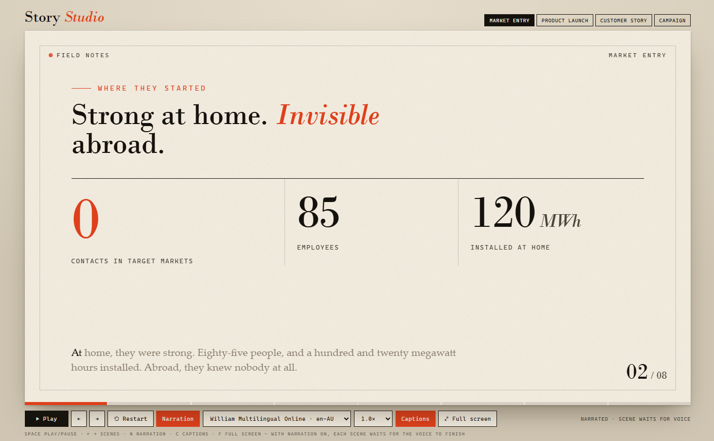

# Narrated Story Animation

Turns a customer story, market-entry journey, product launch, campaign, case study, or learning tutorial into a self-contained cinematic HTML story. Uses the Story Studio editorial design — warm paper stage, serif headlines, scene motion, captions, narration, and playback controls.

## What you get

- A 6–9 scene narrated story (title, stats, bars, route, network, timeline, quote, result, CTA as the story requires)
- One offline HTML file with no CDNs, fonts, or external libraries
- Playback, captions, narration, voice picker, speed, scrubber, and full screen
- Keyboard shortcuts: Space, arrows, N, C, F
- Output saved to the site Reports library
- Fictional samples clearly labelled when no source is supplied

## When to use

Ask Copilot:

- *"make a narrated animation"*
- *"turn this case study into an animated story"*
- *"create a customer story animation"*
- *"make a narrated tutorial"*
- *"make a story demo like the story studio"*

## Demo content

Finished samples are in [`demo/sample-files/`](./demo/sample-files/):

- `story-studio.html` — Story Studio reference with multiple story types
- `Routewise-Fictional-Logistics-Customer-Story.html` — labelled fictional customer story

Do not upload the `demo/` folder with the skill package.

## SharePoint Skill

| Solution | Author(s) |
| --- | --- |
| narrated-story-animation | Anand Ragavan &#124; [GitHub](https://github.com/anandragav) &#124; [LinkedIn](https://www.linkedin.com/in/anand-vijayaragavan-89443012/) |

## Version history

| Version | Date | Comments |
| --- | --- | --- |
| 1.0 | September 2026 | Initial Release |

## Disclaimer

**THIS CODE IS PROVIDED _AS IS_ WITHOUT WARRANTY OF ANY KIND, EITHER EXPRESS OR IMPLIED, INCLUDING ANY IMPLIED WARRANTIES OF FITNESS FOR A PARTICULAR PURPOSE, MERCHANTABILITY, OR NON-INFRINGEMENT.**

