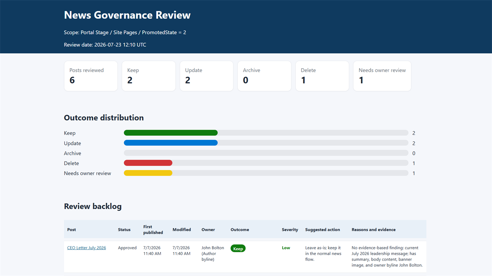

# News Governance Review

Reviews the news posts on a SharePoint intranet site and flags content that appears obsolete, draft-like, incomplete, poorly targeted, or missing ownership. It uses only the default Site Pages fields, so it works on any modern SharePoint site - no custom columns or setup required. Each post gets a recommended outcome - **Keep**, **Update**, **Archive**, **Delete**, or **Needs owner review** - with evidence-based reasons and a severity, delivered as a self-contained HTML dashboard that works directly as a cleanup backlog. It is strictly advisory and read-only: it never deletes, unpublishes, archives, or edits anything.

## What you get

- Every news post in scope classified as Keep / Update / Archive / Delete / Needs owner review, with the specific reasons and evidence behind each recommendation (Archive means "take out of the news flow but keep the content" — e.g., demote from news, move to an archive section, or unpublish — since SharePoint has no page-level archival)
- Severity per finding (High / Medium / Low) so the report reads as a prioritized backlog
- Obsolete-content detection: events and deadlines that have passed, "coming soon" wording with no later update, references to retired systems
- Draft-like and incomplete content detection: placeholders (`TBD`, `TODO`, `test`, `lorem ipsum`), missing summaries, near-empty bodies, missing banner images
- Governance and findability checks: unclear ownership, vague titles, generic summaries
- Owner identification with a fallback chain (author byline → last modified by → created by), flagging accounts that no longer resolve as "owner may have left - verify"
- Link quality findings, with "Link should be manually verified." for anything unverifiable
- A color-coded, self-contained HTML dashboard saved to a `News Review Reports` folder
- Strictly read-only: every action is a suggestion - content owners decide what happens

## When to use

Ask Copilot any of the following (or close variations):

- *"review news"* / *"review our news posts"* / *"news review report"*
- *"news governance"* / *"audit news posts"*
- *"check news quality"* / *"find outdated news"*
- *"clean up intranet news"* / *"news cleanup backlog"*
- *"which news posts are obsolete"*

Be on the site whose news you want to review, name a site or pages library, or select specific pages — the skill reviews the current site's news posts (Site Pages promoted as news) by default. Optional filters like "news older than a year" or "the 20 oldest posts" are honored.

## Prerequisites

- A SharePoint site with news posts in its Site Pages library.
- Read access to the pages. The skill only reads pages and metadata and writes an HTML report file - it never changes pages, metadata, or the library, so no special setup is required.
- Works with the default Site Pages schema - no custom columns (expiry date, owner, category, tags, audience targeting) are needed or evaluated.

## SharePoint Skill

| Solution | Author(s) |
| --- | --- |
| news-governance-review | [Saurabh Tripathi](https://github.com/saurabh7019) |

## Version history

| Version | Date | Comments |
| --- | --- | --- |
| 1.0 | July 2026 | Initial Release |

## Disclaimer

**THIS CODE IS PROVIDED _AS IS_ WITHOUT WARRANTY OF ANY KIND, EITHER EXPRESS OR IMPLIED, INCLUDING ANY IMPLIED WARRANTIES OF FITNESS FOR A PARTICULAR PURPOSE, MERCHANTABILITY, OR NON-INFRINGEMENT.**

