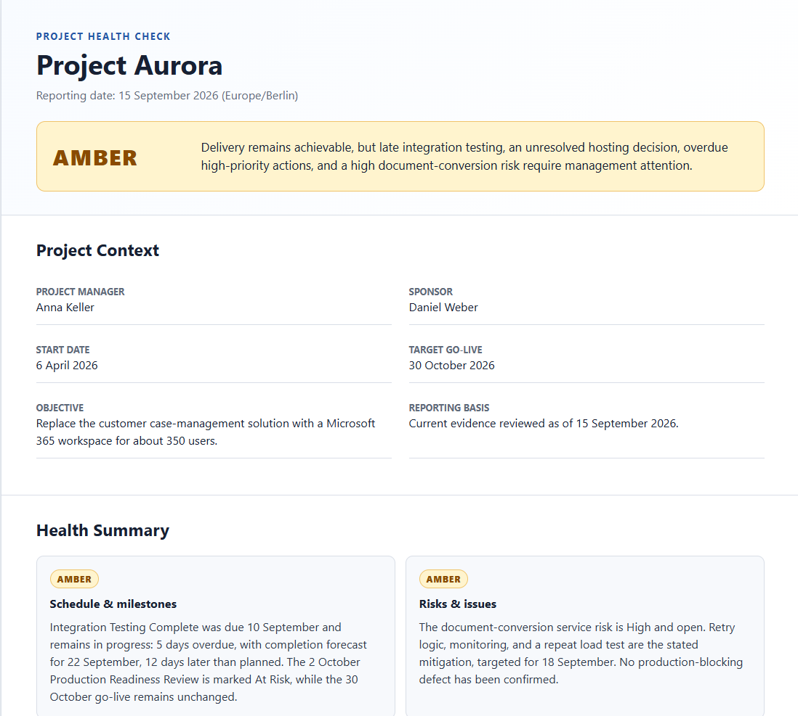
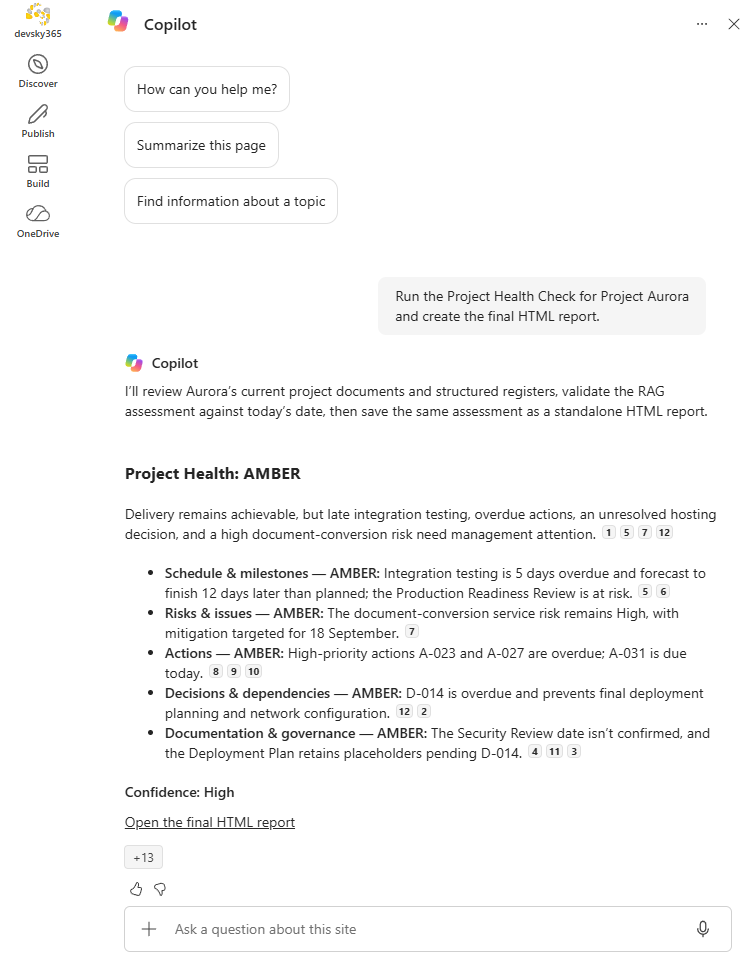

# Project Health Check

Analyze SharePoint project evidence and produce an evidence-based project health assessment across schedule, risks, actions, decisions, dependencies, and governance. The skill can also generate a self-contained HTML management report that can be saved and opened directly as a webpage.

## What you get

- Overall **GREEN / AMBER / RED / UNKNOWN** project health
- Health assessment for schedule, risks, actions, decisions/dependencies, and documentation/governance
- Evidence-based management attention items with owners and due dates when known
- Explicit handling of overdue dates, forecast variance, future deliverables, and incomplete evidence
- Confidence and evidence-coverage assessment
- Optional standalone HTML5 management report with embedded CSS and no external runtime dependencies
- Synthetic **Project Aurora** demo data for an end-to-end test

## Try it

Upload the inner `project-health-check` folder to the SharePoint Skills library and use a prompt such as:

> Run the Project Health Check for Project Aurora.

To create the standalone report:

> Run the Project Health Check for Project Aurora and create the final HTML report.

The skill uses only evidence available to the current user. It does not invent owners, dates, risks, required documents, or project status.

## Demo

The [`demo`](./demo) folder contains synthetic Project Aurora project documents and CSV data for five SharePoint lists. The data intentionally produces an **AMBER** result around 15 September 2026 while keeping the target go-live achievable.

See [`demo/README.md`](./demo/README.md) for setup and expected findings.

## SharePoint Skill

| Solution | Author(s) |
| --- | --- |
| project-health-check | Marc Andre Schroeder-Zhou &#124; [GitHub](https://github.com/maschroeder-z) |

## Version history

| Version | Date | Comments |
| --- | --- | --- |
| 1.0 | September 2026 | Initial Release |

## Disclaimer

**THIS CODE IS PROVIDED _AS IS_ WITHOUT WARRANTY OF ANY KIND, EITHER EXPRESS OR IMPLIED, INCLUDING ANY IMPLIED WARRANTIES OF FITNESS FOR A PARTICULAR PURPOSE, MERCHANTABILITY, OR NON-INFRINGEMENT.**

