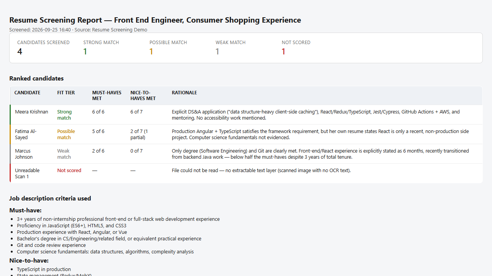

# Resume Screening Summarizer

Screens a library of resumes or job applications against a job description's must-have and nice-to-have criteria, then produces a ranked candidate summary. Saves a color-coded, self-contained HTML report the hiring team can use to build a shortlist — without contacting candidates or modifying any files.

## What you get

- Every candidate's resume parsed and scored against the job description's must-have and nice-to-have requirements
- A fit tier for each candidate — **Strong match**, **Possible match**, **Weak match**, or **Not scored** (unreadable file)
- A ranked table showing must-haves met, nice-to-haves met, and a one-line rationale per candidate, grounded in the candidate's actual resume text rather than a generic score
- The exact criteria used for scoring, so reviewers can audit the basis for every result
- A color-coded, self-contained HTML report saved to the library with a timestamped filename
- Strictly read-only behavior — no candidates are contacted, no resumes are modified, no content is altered besides the saved report

Validated against a batch of 20+ synthetic resumes and an Amazon-style job description spanning all four fit tiers, including edge cases like alternate frameworks (Vue/Angular vs. React), ambiguous degree fields, resumes where total job tenure doesn't match the actual front-end experience described, and image-only PDFs with no extractable text. See [`demo/`](./demo/) for a smaller, ready-to-try sample set.

## When to use

Ask Copilot:

- "screen these resumes" / "screen resumes for this role"
- "rank candidates for this role" / "shortlist applicants"
- "match resumes to the job description"
- "resume screening" / "review applications for this position"

Use it when a role has closed for applications and the hiring team needs a first-pass shortlist, or any time a large batch of resumes needs to be triaged against stated job criteria before manual review.

## Prerequisites

- A SharePoint library or folder containing resumes/applications (.pdf, .docx, .doc)
- A job description document, page, or pasted text describing must-have and nice-to-have criteria
- Read access to the resume library and permission to create the HTML report file in a document library on the current site

## SharePoint Skill

| Solution | Author(s) |
| --- | --- |
| resume-screening-summarizer | Bharath R &#124; [GitHub](https://github.com/Bharath-spd) |

## Version history

| Version | Date | Comments |
| --- | --- | --- |
| 1.0 | September 2026 | Initial Release |

## Disclaimer

**THIS CODE IS PROVIDED _AS IS_ WITHOUT WARRANTY OF ANY KIND, EITHER EXPRESS OR IMPLIED, INCLUDING ANY IMPLIED WARRANTIES OF FITNESS FOR A PARTICULAR PURPOSE, MERCHANTABILITY, OR NON-INFRINGEMENT.**

