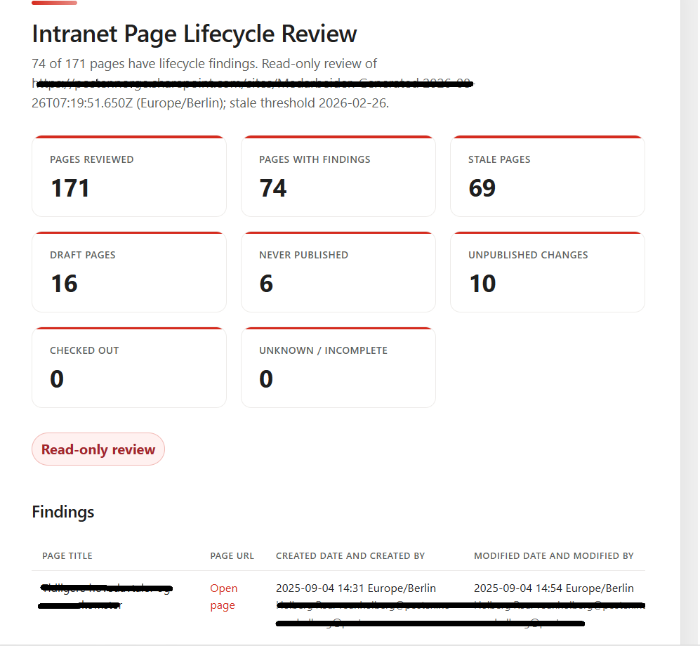
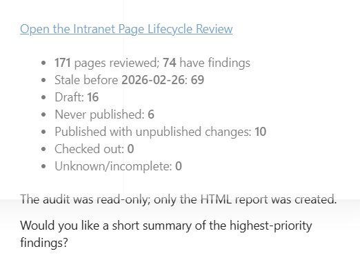

# SharePoint Page Governance

Analyzes a SharePoint Site Pages library and creates a structured HTML report covering stale, draft, unpublished, and checked-out pages.

## Preview

**Generated lifecycle report:**

**Report completion summary:**

## What you get

- Site Pages lifecycle overview
- Stale page analysis
- Draft and never-published page counts
- Pages with unpublished changes
- Checked-out page details
- Recommended follow-up actions
- Read-only analysis with no page or library changes

## SharePoint Skill

| Solution | Author(s) |
| --- | --- |
| sharepoint-page-governance | — |

## Version history

| Version | Date | Comments |
| --- | --- | --- |
| 1.0 | August 2026 | Initial Release |

## Disclaimer

**THIS CODE IS PROVIDED _AS IS_ WITHOUT WARRANTY OF ANY KIND, EITHER EXPRESS OR IMPLIED, INCLUDING ANY IMPLIED WARRANTIES OF FITNESS FOR A PARTICULAR PURPOSE, MERCHANTABILITY, OR NON-INFRINGEMENT.**

