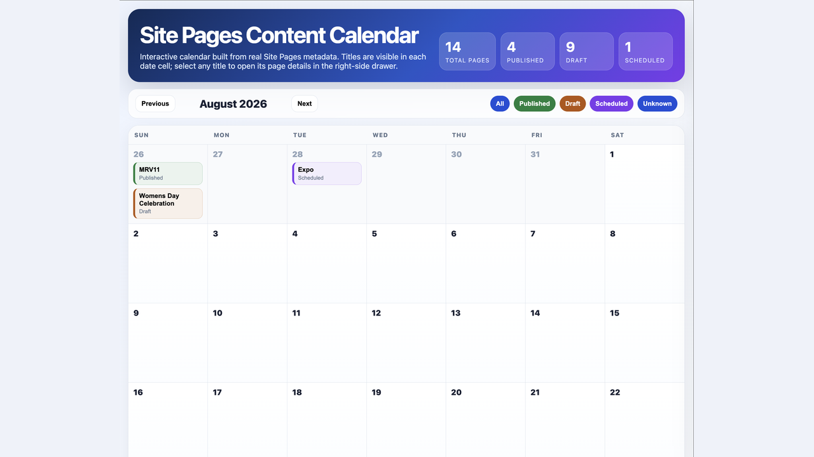

# Site Pages Content Calendar

Builds a full-size, interactive SharePoint Site Pages publishing/content calendar as a self-contained HTML dashboard.

## What you get

- Calendar coverage for the current SharePoint site's Site Pages library
- Safe page status classification for Published, Draft, Scheduled, and Unknown pages
- Strict scheduled-page logic that only treats pages as scheduled when `_ScheduledVersion` is present or `_ModerationStatus` explicitly says Scheduled
- Full-size responsive HTML calendar that uses the available page and browser viewport area
- Visible page titles directly in calendar cells, with compact status indicators and overflow handling
- True right-side overlay drawer with detailed metadata when a page title is clicked
- Source page links, placement logic, page metadata, author/editor details, version, layout, and description
- A self-contained HTML dashboard saved back to SharePoint

## When to use

Ask Copilot:

- _"create an interactive content calendar for site pages"_
- _"build a site pages calendar dashboard"_
- _"make a SharePoint page publishing calendar"_
- _"show drafts, published, and scheduled pages in a calendar"_
- _"generate an HTML dashboard for page status and publish dates"_

Best when you need a quick visual review of SharePoint page activity, publishing status, draft inventory, scheduled content, and page-level metadata without changing any pages.

## SharePoint Skill

| Solution                          | Author(s)                                                                                                              |
| --------------------------------- | ---------------------------------------------------------------------------------------------------------------------- |
| site-pages-content-calendar       | Sandeep P S ( [GitHub](https://github.com/Sandeep-FED) &#124; [LinkedIn](https://www.linkedin.com/in/sandeepps1299/) ) |

## Version history

| Version | Date      | Comments        |
| ------- | --------- | --------------- |
| 1.0     | July 2026 | Initial Release |

## Disclaimer

**THIS CODE IS PROVIDED _AS IS_ WITHOUT WARRANTY OF ANY KIND, EITHER EXPRESS OR IMPLIED, INCLUDING ANY IMPLIED WARRANTIES OF FITNESS FOR A PARTICULAR PURPOSE, MERCHANTABILITY, OR NON-INFRINGEMENT.**

