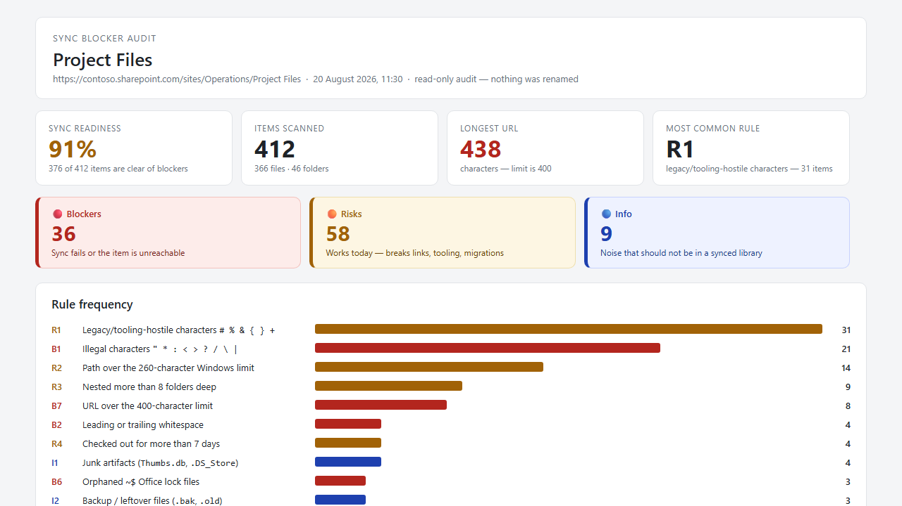

# Sync Blocker Auditor

Audits a SharePoint document library for the names and paths that break **OneDrive sync, File
Explorer, and the Teams Files tab**. It scans every file and folder, flags illegal characters,
trailing spaces and periods, Windows reserved names, `#`/`%` legacy characters, URLs over the
400-character limit, deep nesting, long-term checked-out files, and junk artifacts — then scores
sync readiness and saves a self-contained HTML report with a **proposed safe name for every
blocked item**. It is strictly read-only: nothing is ever renamed.

## What you get

- A **sync readiness score** for the library, plus Blocker / Risk / Info counts
- Every finding mapped to a numbered rule (`B1`–`B8`, `R1`–`R6`, `I1`–`I3`) with a
  plain-English explanation of what actually breaks
- A **proposed safe name** for every blocked item — illegal characters replaced, whitespace and
  trailing periods trimmed, reserved names escaped, long names shortened without losing the
  extension
- A **path-length table** measuring the 10 longest full URLs against both the 400-character
  SharePoint limit and the 260-character Windows limit that breaks File Explorer first
- A **checked-out table** listing files locked for more than 7 days, and by whom
- **Folder hot spots** and a prioritised, plain-English remediation list
- A colour-coded, self-contained HTML report saved to a `Sync Reports` folder — no scripts, no
  external resources, no Power Automate, no custom code
- Strictly read-only: it never renames, moves, deletes, or checks in anything — the only thing
  it writes is the HTML report

## How this differs from the naming checks in other skills

`library-cleanup` and `analyze-document-library` look for names that are **unhelpful to humans**
(`Document.docx`, `Misc`, `Copy of Copy of...`). This skill ignores readability entirely and
looks only for names that are **technically invalid** for the sync engine and the URL space. A
perfectly descriptive file name can still be a hard blocker, and a badly named file can be
completely sync-safe.

## When to use

Ask Copilot any of the following (or close variations):

- *"sync blockers"* / *"sync health check"* / *"sync readiness report"*
- *"why won't this library sync"* / *"OneDrive sync errors"*
- *"check file names"* / *"invalid file names"* / *"illegal characters"*
- *"path too long"* / *"url too long"* / *"400 character limit"*
- *"files stuck checked out"*

Be in the library you want to audit, name one, or have a folder selected — the skill audits the
current library recursively by default.

## What it checks

| Severity | Rules |
| --- | --- |
| **Blocker** | Illegal characters `" * : < > ? / \ \|`, leading/trailing whitespace, trailing period, Windows reserved device names (`CON`, `PRN`, `AUX`, `NUL`, `COM0`–`COM9`, `LPT0`–`LPT9`), reserved SharePoint/OneDrive names (`.lock`, `desktop.ini`, `_vti_`, root `forms`), `~$` lock files, URL over 400 characters, name segment over 255 characters |
| **Risk** | `#` `%` `&` `{` `}` `+` in names, path over the 260-character Windows limit, nesting deeper than 8 levels, checked out for more than 7 days, control/zero-width/bidirectional characters, `.tmp` files (which OneDrive never syncs) |
| **Info** | `Thumbs.db`, `.DS_Store`, `ehthumbs.db`, backup leftovers (`.bak`, `.old`, `.partial`, `.crdownload`, `.laccdb`), zero-byte files |

The `#` and `%` characters have been fully supported by SharePoint Online since 2017, so they
are reported as an advisory **Risk**, never as a sync failure — they still trip up
hand-constructed REST/CSOM URLs, migration tools, and on-premises clients.

## Prerequisites

- A SharePoint document library.
- **Read** access to the library being audited — the skill only reads names, paths, sizes, and
  check-out state, and never modifies it.
- **Contribute** access somewhere on the site (the default Documents or Site Assets library) so
  the HTML report can be saved. If you have no write access at all, the skill returns the full
  findings inline instead of saving a file.
- No column setup, Power Automate flow, or admin role is required.

## Demo content

Sample content for trying this skill end-to-end is in the [demo/](./demo/) subfolder. It
includes a ready-made set of files covering the main rule categories, plus the expected audit
results to verify against. Skip this folder when uploading the skill to SharePoint.

## Sample output

A full example of the generated report is in
[`assets/Sync-Blocker-Audit-Project-Files-2026-08-20-1130.html`](./assets/Sync-Blocker-Audit-Project-Files-2026-08-20-1130.html).

## SharePoint Skill

| Solution | Author(s) |
| --- | --- |
| sync-blocker-auditor | Bhupendra Kaushik &#124; [GitHub](https://github.com/Bhupendrakaushik) |

## Version history

| Version | Date | Comments |
| --- | --- | --- |
| 1.0 | August 2026 | Initial Release |

## Disclaimer

**THIS CODE IS PROVIDED _AS IS_ WITHOUT WARRANTY OF ANY KIND, EITHER EXPRESS OR IMPLIED, INCLUDING ANY IMPLIED WARRANTIES OF FITNESS FOR A PARTICULAR PURPOSE, MERCHANTABILITY, OR NON-INFRINGEMENT.**

