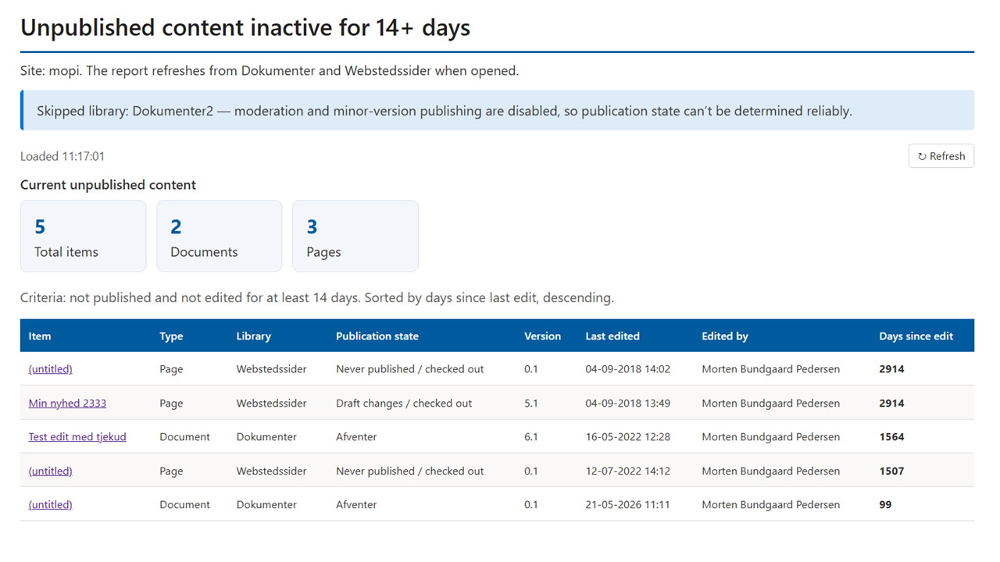

# Unpublished Content Report

This skill generates a HTML report in a specific library (default: Reports) showing documents and pages that are in an unpublished or checked out state and has been so for 14 (default) days.

At top of report it shows a short summary of the findings. Below follows a detailed list of documents and pages with their current state and the number of days since the item was last edited. The list is ordered by 'days since edit' in descending order (default).

Ideal for content administrators to get an easy overview of content that authors or approvers forgot to publish or has been checked out by mistake and blocking other users from editing.

## What you get

You will get a HTML based report across all documents and pages on your site showing which documents and pages are either not published or checked out and has not been edited for 14 days default or the number of days you choose. 

Report will be stored by default in a Reports library which will be created if it is not created already. You can ask to have the report stored elsewhere or modify the skill.md file for permanent change.

Report contains a summary first and then a list of documents/pages found that are either checked out or unpublished for more than the chosen number of days (default 14). The list shows details like
- Item type
- Library name
- Publication state
- Version
- Last edited
- Edited by
- Days since edit.

## SharePoint Skill

| Solution | Author(s) |
| --- | --- |
| unpublished-content-report | Morten Bundgaard Pedersen &#124; [GitHub](https://github.com/MortenPedersenDK) &#124; [LinkedIn](www.linkedin.com/in/mortenbpedersen) |

## Version history

| Version | Date | Comments |
| --- | --- | --- |
| 1.0 | August 2026 | Initial Release |

## Disclaimer

**THIS CODE IS PROVIDED _AS IS_ WITHOUT WARRANTY OF ANY KIND, EITHER EXPRESS OR IMPLIED, INCLUDING ANY IMPLIED WARRANTIES OF FITNESS FOR A PARTICULAR PURPOSE, MERCHANTABILITY, OR NON-INFRINGEMENT.**

