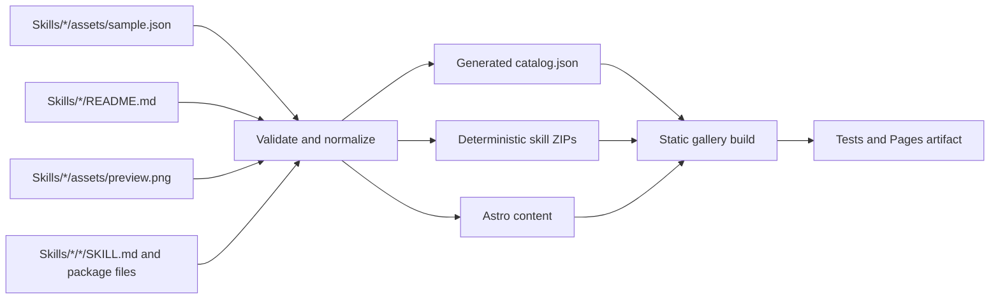

# SharePoint Skills gallery and publishing plan

Status: Baseline implemented; launch approvals and hardening remain  
Last updated: 2026-08-26  
Target: `https://pnp.github.io/sharepoint-skills/`

## Publishing verification follow-ups

- [ ] Automate the temporary skill lifecycle test (add, update, and delete) so catalog totals, contributor counts, routes, previews, and downloads are checked without retaining a fixture. The 2026-08-26 manual smoke test passed for 47 -> 48 -> 47 skills with `VesaJuvonen` attribution.
- [ ] Add a build-artifact consistency gate that requires catalog entries, detail pages, ZIP packages, and preview pairs to have matching totals before upload.
- [ ] Extend the post-deploy smoke test to compare the live catalog total with the rendered home total and verify the contributor directory, instead of checking only one known skill.

## Outcome

Build a searchable, accessible, static gallery for every skill under `Skills/`. The gallery will be generated from repository-owned metadata on every pull request and deployed from `main` through GitHub Pages.

The experience should combine:

- the dynamic catalog, detail pages, contributor directory, downloads, and GitHub-native community features demonstrated by [CAT Agent Skills](https://microsoft.github.io/cat-agent-skills/);
- the visual identity, image-first sample cards, information density, filtering model, and community tone of the [PnP SPFx samples gallery](https://pnp.github.io/sp-dev-fx-webparts/); and
- this repository's existing `Skills/<slug>/assets/sample.json`, `README.md`, `preview.png`, and packaged skill structure.

## Principles and decisions

- [x] Approve `Skills/<slug>/assets/sample.json` as the canonical catalog metadata source.
- [x] Keep `Skills/<slug>/README.md` as authored human documentation. Do not generate or overwrite it from metadata.
- [x] Keep `Skills/<slug>/<slug>/` as the canonical downloadable skill package.
- [x] Treat the folder slug as the permanent skill identity and route: `/skills/<slug>/`.
- [x] Preserve compatibility with the established PnP `sample.json` shape. Add fields only for an approved gallery or lifecycle requirement.
- [x] Derive values that already have a reliable source, including slug, source paths, download paths, author counts, and category counts.
- [x] Generate catalog data, rendered pages, and ZIP files during the build. Do not commit generated site artifacts back to contributor branches or `main`.
- [x] Use a static site with no required database or runtime service.
- [x] Build all content from a clean checkout. Never fetch skill content from `main` at browser runtime.
- [ ] Use GitHub Discussions for embedded comments and reactions; use GitHub Issues for actionable bugs and proposals.
- [x] Start without ratings, analytics, or other GitHub API dependencies. Add them only after the core gallery is reliable and the privacy/operations model is approved.
- [x] Do not execute scripts shipped inside contributed skills during validation or site generation.

## Current repository baseline

- [x] Every current skill has an outer `README.md`, `assets/sample.json`, `assets/preview.png`, and a same-name inner skill package.
- [x] The 47 current `sample.json` files provide title, short and long descriptions, created/updated dates, products, category metadata, thumbnails, authors, and references.
- [x] `.github/scripts/validate_skills.py` validates structure, names, dates, metadata, authors, references, README conventions, local links, and 1280x720 PNG previews.
- [x] `.github/workflows/validate-skill-pr.yml` validates every skill and maintains one pull-request summary comment.
- [x] The baseline now includes the Astro application, catalog artifact, Pages workflow, downloadable packages, and browser-level quality suite.

## Cost model and resource efficiency

### Expected operating cost

The target steady-state infrastructure cost is **USD 0 per month** under the current public-repository model:

- GitHub Pages is available for public repositories and hosts the static site on `pnp.github.io` without a separate hosting service.
- Standard GitHub-hosted runners are free for public repositories and GitHub Pages workflows.
- GitHub Issues and Discussions have no separate infrastructure charge.
- giscus is open source, has no database, stores content in GitHub Discussions, and is free when its hosted service is used.
- The default `pnp.github.io/sharepoint-skills` address has no domain-registration cost.

Costs or service changes could arise from larger GitHub-hosted runners, excess retained Actions artifacts or caches, a purchased custom domain, a third-party CDN, private-repository conversion, or future paid external services. Microsoft Clarity is free, but its privacy and consent cost is operational rather than financial and it is not required for launch.

GitHub Pages currently documents a 1 GB published-site limit, a 10-minute deployment timeout, and a soft 100 GB monthly bandwidth limit. These are capacity guardrails, not launch blockers for the current catalog.

Measured repository baseline on 2026-08-25:

- 47 source previews total 9.14 MB, averaging 199 KB each;
- all inner skill packages total 0.68 MB uncompressed; and
- the complete `Skills/` tree totals 16.38 MB.

At current scale, images are the meaningful page-view cost and packages are negligible. The gallery must still avoid loading all 9.14 MB of previews on the first view.

- [ ] Record a monthly budget target of USD 0 and require maintainer approval before introducing any metered service or larger runner.
- [ ] Configure GitHub organization budget alerts and keep the workflows functional when paid Actions usage is disabled.
- [ ] Report build duration, artifact size, published-site size, initial page weight, and total downloadable-package size in the workflow summary.
- [ ] Fail the build before the Pages limits become urgent: target site size below 500 MB and deployment time below 5 minutes.
- [ ] Reassess hosting when monthly transfer consistently approaches 75 GB, the site approaches 750 MB, or deployment approaches 8 minutes.

### Contribution impact optimization

Use tiered checks so every contributor gets fast, useful feedback without repeatedly running the most expensive browser matrix:

- **Tier 1, every relevant PR:** existing Python validation, schema checks, changed-skill policy, deterministic catalog/package generation, and focused unit tests.
- **Tier 2, skill-content PRs:** one production site build and one Chromium desktop/mobile smoke path covering the changed skill, search discovery, detail route, preview, and download.
- **Tier 3, site or pipeline PRs:** full unit suite, production build, accessibility checks, responsive screenshots, and Chromium/Firefox/WebKit coverage.
- **Tier 4, `main` deployment:** reuse one production build for final tests and Pages deployment; do not rebuild separately in each job.
- **Tier 5, scheduled assurance:** run only slow link checking, broad browser regression, or external-data refreshes that have demonstrated value; do not schedule a no-op daily deployment.

- [x] Use path filters so documentation-only root changes do not install or build the site unnecessarily.
- [x] Keep `cancel-in-progress: true` so a new commit cancels superseded PR work.
- [x] Install dependencies and build once per workflow, then pass the immutable build artifact to test/deploy jobs.
- [x] Use dependency caching keyed by lockfile; keep cache use below GitHub's included repository allowance.
- [ ] Keep successful PR artifacts for 3 days and failed-run traces/screenshots for 7 days unless maintainers establish a longer diagnostic need.
- [x] Upload Playwright traces and screenshots on failure only; publish a small representative screenshot set for successful visual-change PRs.
- [ ] Do not upload the complete production site on every metadata-only PR unless a downloadable preview is requested.
- [x] Avoid generated-file commits, bot follow-up workflows, and duplicate `push` plus `pull_request` builds for the same pre-merge commit.
- [ ] Set job timeouts and measure the 95th-percentile feedback time; target Tier 1 below 2 minutes and the normal skill PR below 5 minutes.
- [x] Use GitHub's native job summary and sticky PR comment instead of retaining redundant report artifacts.

### Page-view and download impact optimization

Static Pages views do not consume Actions minutes. Their limiting resource is transfer, dominated by previews and downloadable packages rather than HTML or catalog JSON.

- [x] Generate responsive WebP derivatives from each source PNG at build time; keep the original PNG available for documentation and social sharing. AVIF remains an optional measured optimization.
- [x] Use `srcset`, explicit dimensions, and lazy loading for below-the-fold images; preload only the first visible preview when measurement supports it.
- [ ] Content-hash generated CSS, JavaScript, and image derivatives for durable browser caching.
- [x] Keep the initial route useful with server-rendered HTML and a small search/filter enhancement bundle; do not hydrate every skill card.
- [x] Split detail-page Markdown and media from the gallery route so browsing the catalog does not download every README.
- [ ] Load giscus, videos, analytics, and other third-party resources only after interaction or when their section approaches the viewport.
- [x] Avoid runtime GitHub API calls for catalog, authors, or ratings; use build-time snapshots with graceful fallbacks.
- [ ] Track a mobile initial-transfer budget of 500 KB excluding the first preview and a JavaScript budget of 150 KB compressed; tighten these after measuring the prototype.
- [ ] Track transfer separately for page assets and skill ZIP downloads. As a rough capacity check, 100 GB supports about 200,000 visits at 500 KB each, but only 10,000 downloads of a 10 MB package.
- [x] Keep small skill packages on Pages for the first release. Move large or high-volume packages to immutable GitHub Release assets before downloads threaten the Pages bandwidth or site-size thresholds.
- [x] Do not add a paid CDN speculatively. Add one only after measured traffic, geographic performance, or Pages rate limiting demonstrates the need.
- [ ] If analytics is approved, collect only the minimum aggregate data needed to answer search success, no-results queries, detail views, and download conversions; do not make session recording a prerequisite for product decisions.

## Proposed architecture

### Repository layout

```text
site/
  package.json
  package-lock.json
  astro.config.mjs
  public/
  src/
    components/
    layouts/
    pages/
      index.astro
      getting-started.astro
      contributing.astro
      contributors.astro
      skills/[slug].astro
      categories/[category].astro
      catalog.json.ts
    styles/
    generated/                 # build output; ignored by Git
  tests/
    unit/
    e2e/
.github/
  schemas/
    sample.schema.json
    catalog.schema.json
  scripts/
    gallery_model.py           # shared loading, normalization, and policy
    generate_gallery.py        # catalog and deterministic package generation
    validate_skills.py         # existing validation, refactored to shared model
  workflows/
    validate-skill-pr.yml      # existing workflow, expanded with gallery CI
    deploy-gallery.yml
```

Astro is the preferred implementation because the reference CAT gallery proves the static content model, it produces minimal client JavaScript, and it supports build-time detail routes and JSON endpoints. Confirm this choice in an architecture decision record before scaffolding.

### Build data flow



- [ ] Refactor shared parsing and policy out of `validate_skills.py`; validation and generation must use the same normalized model.
- [x] Validate `sample.json` with a checked-in JSON Schema plus the repository-specific semantic checks already implemented in Python.
- [x] Emit one normalized catalog record per skill in stable slug order so builds are deterministic.
- [x] Fail on duplicate slugs, duplicate sample names, invalid dates, unsafe paths, or schema violations; retain unknown-dependency policy in the existing semantic validator.
- [x] Render README Markdown at build time with raw HTML sanitized through an explicit allowlist.
- [x] Generate `/catalog.json` as a documented, versioned public feed for future integrations.
- [x] Generate `/downloads/<slug>.zip` from only `Skills/<slug>/<slug>/**`.
- [x] Reject symlinks, absolute paths, path traversal, and files outside the inner package when generating ZIPs.
- [x] Sort ZIP entries, normalize timestamps, and emit SHA-256 values so repeat builds are byte-for-byte reproducible.
- [x] Exclude `sample.json`, gallery previews, outer documentation, demos, and other non-package files from skill ZIPs.

### Metadata policy

Use the existing fields for the first release:

- `title`, `shortDescription`, `longDescription` for catalog and detail copy;
- `creationDateTime` and `updateDateTime` for sorting and freshness;
- `products` for product badges;
- `metadata` values for controlled facets, beginning with `SKILL-CATEGORY`;
- `thumbnails` for the image gallery, alt text, and social previews;
- `authors` for bylines and the contributors directory; and
- `references` for related documentation.

- [x] Publish the current shape as `.github/schemas/sample.schema.json` without forcing a migration solely to add a schema-version property.
- [ ] Define a controlled category list from the values already in the 47 files; document capitalization and ownership.
- [x] Derive MVP search terms from slug, title, descriptions, category, products, author names, and GitHub handles.
- [x] Do not add `keywords`, difficulty, duration, popularity, accessibility claims, or industry tags until a user-facing filter or governance process requires them.
- [x] If lifecycle state is required, introduce one controlled metadata key such as `SKILL-STATUS` with `stable`, `preview`, `deprecated`, and `archived`; default legacy entries to `stable` in the normalizer.
- [ ] If richer filtering is approved after usage testing, add controlled repeatable metadata keys rather than unrelated top-level fields.
- [x] Never store computed ratings, download counts, contributor totals, repository URLs, or generated package URLs in source metadata.
- [ ] Require `updateDateTime` to advance when user-visible skill content changes; report this clearly in the PR validation comment.
- [ ] Require a redirect entry for any approved slug rename so existing links remain valid.

## Information architecture and content

### Primary navigation

- [x] `Skills`: gallery home and default route.
- [x] `Getting started`: prerequisites, installation, first run, permissions, and safe-use guidance.
- [x] `Contributors`: people derived from skill metadata, their skills, and contribution counts.
- [x] `Contributing`: concise web guidance with links to the repository template and full contribution policy.
- [x] `GitHub`: repository link.
- [x] `Report an issue`: repository issue form.

### Gallery home

- [x] Use the PnP visual language and pinned MIT-licensed PnP key art: bright neutral canvas, PnP blue and teal accents, strong typography, restrained borders, and image-first 16:9 previews.
- [x] Keep the actual catalog in the first viewport; avoid a marketing landing page.
- [x] Show total skill count and active-filter result count.
- [x] Search title, descriptions, category, products, and contributors client-side with shareable URL parameters.
- [x] Provide category and product filters, contributor filtering, and sort by newest, recently updated, and name.
- [x] Use a persistent filter rail on wide screens and an accessible filter drawer on narrow screens.
- [x] Show preview, title, short description, category, author avatar/name, and updated date on each card.
- [x] Lazy-load previews below the fold with fixed aspect ratios and explicit image dimensions.
- [x] Include useful empty, no-JavaScript, and invalid-query states; static rendering removes the need for a loading state.
- [x] Preserve query, filters, sort, and native browser scroll restoration when returning from a detail page.
- [x] Do not use infinite scrolling for the first release. Use paginated or progressively revealed results with an accessible result count and stable browser history.

### Skill detail pages

- [x] Show title, short description, category, products, status when present, created/updated dates, authors, and repository source.
- [x] Show the primary 1280x720 preview prominently; support additional image or video thumbnails later without changing the route model.
- [x] Provide primary `Download skill` and secondary `View source` actions.
- [x] Show package size and SHA-256 checksum next to the download.
- [x] Render the outer README as the main human guidance without duplicating catalog metadata headings.
- [x] Provide a collapsible view of `SKILL.md` and a direct raw Markdown download where useful.
- [x] Show references and related skills. Initially derive related skills from shared categories; allow explicit relationships only when curation needs them.
- [x] Generate skill-specific bug and improvement links with a prefilled title containing the immutable slug.
- [x] Set canonical URLs, Open Graph metadata, preview images, structured data, sitemap entries, and accessible breadcrumbs.
- [x] Generate a useful not-found page with catalog and category links.

### Contributors

- [x] Aggregate contributors from `sample.json` authors, keyed case-insensitively by `gitHubAccount`.
- [x] Show avatar, display name, optional company, GitHub link, skill count, and linked skills.
- [x] Distinguish catalog authors from general repository commit contributors; link to GitHub's contributor graph for the latter.
- [ ] Validate that one GitHub handle does not resolve to conflicting display names or picture URLs across skills.
- [x] Keep the page functional without GitHub API access; metadata remains the authoritative attribution source.
- [ ] Add recognition badges only after transparent rules and accessibility treatment are documented.

### Getting started and supporting pages

- [x] Explain what a SharePoint skill is and which supported agent experience can consume it.
- [x] Document prerequisites and least-privilege SharePoint access.
- [x] Provide installation steps for the supported host without publishing unverified commands.
- [x] Walk through installing one representative skill, starting a new session, invoking it, and reviewing its output.
- [x] Explain the difference between outer gallery assets and the downloadable inner skill package.
- [x] Add safe-use guidance for write operations, approvals, sensitive information, and generated output review.
- [x] Link to `Skills/TROUBLESHOOTING.md` and surface common installation/discovery problems.
- [ ] Add FAQ, support boundaries, security reporting, license, code of conduct, and privacy links.
- [x] Add a `What's new` view derived from `updateDateTime`; do not maintain a second manual changelog for skill updates.

## GitHub community integration

### Issues

- [x] Keep GitHub Issues focused on actionable problems and proposals.
- [ ] Add a skill feedback issue form with required skill slug, problem type, expected behavior, host, and reproduction details.
- [ ] Generate per-skill report links with a prefilled `[<slug>]` title and a common `skill-feedback` label.
- [x] Add an issue-form option for repository-wide gallery/accessibility problems that are not tied to one skill.
- [x] Avoid creating one permanent issue per skill; this would add triage noise and make comments hard to discover.
- [ ] Document response expectations and the boundary between community help and Microsoft product support.

### Discussions and comments

- [ ] Enable GitHub Discussions and create a dedicated `Skill feedback` category.
- [ ] Install and configure giscus only for this repository and category.
- [x] Map each detail page to a deterministic term such as `skill:<slug>` for later giscus activation.
- [ ] Load the comments widget only after user interaction so it does not affect initial performance or privacy unexpectedly.
- [x] Provide a direct Discussions link when scripts, cookies, or giscus are unavailable.
- [ ] Document moderation, retention, code of conduct, and what happens when a skill is renamed or archived.
- [ ] Consider reaction-based ratings only after comments are operating reliably. Fetch rating snapshots at build time and fail open to zero when the API is unavailable.

## Pull request automation

### Every skill pull request

- [x] Run on `pull_request`, never `pull_request_target`, for any relevant `Skills/**`, schema, generator, site, or workflow change.
- [x] Use a pinned runtime and lockfile with dependency caching.
- [x] Run the existing full repository validation to prevent cross-skill duplication and taxonomy drift.
- [ ] Detect changed, added, renamed, and removed skill folders for focused PR reporting.
- [x] Validate schemas, metadata policy, README links, preview dimensions, author consistency, dates, and package boundaries.
- [x] Generate the complete catalog and every deterministic ZIP from a clean checkout; optimize later only if measurements show this inexpensive integrity check is a bottleneck.
- [x] Run focused generator unit tests and compare repeated package generation to prove deterministic output.
- [x] Build the production site with the GitHub Pages base path once and reuse that output.
- [x] Run a Chromium desktop/mobile smoke path for normal skill PRs; reserve a broader browser suite for later site/pipeline hardening.
- [x] Run focused automated accessibility checks for the home and representative detail route on desktop and mobile.
- [ ] Check internal links, generated canonical URLs, image references, and downloadable ZIP contents.
- [x] Upload compact failure diagnostics with short retention; do not retain a full preview artifact for metadata-only PRs.
- [ ] Extend the existing sticky PR comment with changed skills, validation result, site-build result, artifact/run link, and any actionable warnings.
- [x] Keep fork PR build permissions read-only and make the best-effort sticky comment the only optional write operation.
- [ ] Add a scope guard that asks contributors to separate skill-content changes from gallery/workflow infrastructure changes unless maintainers explicitly approve the combination.

### Merge and deploy

- [x] Create `.github/workflows/deploy-gallery.yml` triggered by pushes to `main` and manual dispatch.
- [x] Grant only `contents: read`, `pages: write`, and `id-token: write` unless an approved build-time GitHub data feature requires more.
- [x] Re-run all validation, tests, generation, and production build from the merged commit.
- [x] Upload the `dist` folder with `actions/upload-pages-artifact` and deploy with `actions/deploy-pages`.
- [x] Use the protected `github-pages` environment, deployment concurrency, and cancellation of superseded queued runs.
- [x] Publish the deployment URL in the protected environment.
- [x] Run a post-deploy smoke test for the home page, `catalog.json`, a known detail page, a preview image, and a ZIP download.
- [ ] Preserve the previous successful Pages artifact long enough to support documented rollback or commit reversion.
- [x] Do not use a `Docs` branch, `gh-pages` branch, or generated commits for the first release.
- [ ] Add a scheduled rebuild only if ratings or other approved external snapshots are introduced.

### Dependency and workflow hygiene

- [x] Pin GitHub Actions to immutable commit SHAs for production and document the upstream version in comments.
- [x] Configure Dependabot for the site package and GitHub Actions.
- [ ] Enable dependency review for pull requests and CodeQL for site code where applicable.
- [x] Add CODEOWNERS coverage for workflows, schemas, generator code, and site security-sensitive files.
- [x] Keep secrets out of pull-request builds and verify that the production build succeeds without optional GitHub API credentials.

## Quality bar

### Functional tests

- [ ] Unit-test normalization, category extraction, author aggregation, sorting, search document generation, redirects, and package manifests.
- [ ] Add fixtures for malformed JSON, duplicate slugs, unsafe package paths, conflicting authors, missing previews, invalid dates, unknown statuses, and deleted skills.
- [x] Assert that all 47 baseline skills appear in the generated public catalog, with schema and existing semantic validation enforcing identity uniqueness.
- [ ] Assert that every catalog route, source link, preview, and download resolves.
- [ ] Test adding a fixture skill without changing site code; it must appear automatically after generation.
- [ ] Test updating and deleting a fixture skill; the catalog, contributors, categories, routes, and packages must update without stale output.

### Accessibility and responsive behavior

- [ ] Meet WCAG 2.2 AA for all first-party pages.
- [x] Provide skip links, semantic landmarks, one page heading, visible focus, and keyboard-operable controls.
- [x] Associate every filter with a label and announce result-count changes without stealing focus.
- [ ] Honor reduced motion, forced colors, text zoom, and 400% browser zoom.
- [x] Verify useful preview alt text and keep decorative card thumbnails and author avatars out of redundant announcements.
- [ ] Test Chromium, Firefox, and WebKit at representative desktop and mobile widths.
- [ ] Add axe checks and keyboard-path tests to CI; perform a manual screen-reader pass before public launch.

### Performance and resilience

- [ ] Set budgets before implementation: minimal initial JavaScript, fixed-size optimized images, and no layout shift from cards or filters.
- [ ] Target Core Web Vitals in the `good` range on a throttled mobile profile.
- [x] Keep search and filtering local for the expected catalog size; reassess only after measured growth.
- [x] Make the core catalog and detail content usable when optional comments, analytics, avatars, or external references fail.
- [ ] Add a Content Security Policy compatible with GitHub Pages, GitHub avatars, approved video providers, and optional giscus.
- [x] Vendor the pinned MIT-licensed PnP fonts and visual assets; ship no third-party runtime scripts.

### Visual acceptance

- [ ] Create desktop and mobile design references before component implementation.
- [x] Align with the PnP gallery's bright, editorial sample-catalog character and vendor its requested MIT-licensed background assets at a pinned commit.
- [x] Use Fluent UI concepts and PnP brand colors where appropriate, with a distinct SharePoint Skills identity.
- [x] Prefer preview images and meaningful metadata over decorative artwork.
- [x] Keep controls compact, predictable, and suitable for repeated catalog scanning.
- [ ] Run visual regression tests for home, filtered results, empty state, detail, contributors, getting started, and the mobile filter drawer.

## Security, privacy, and governance

- [x] Treat all contributed Markdown, JSON, images, and archive paths as untrusted build input.
- [x] Escape metadata before rendering and sanitize Markdown; do not support arbitrary MDX components or inline scripts from skills.
- [x] Validate outbound URL protocols and add `rel="noopener noreferrer"` to external README links.
- [ ] Set package-size, file-count, and individual-file limits to prevent abusive Pages artifacts.
- [x] Do not expose workflow tokens to pull requests or browser code.
- [ ] Document the threat model for contributed content, generated archives, comments, and supply-chain dependencies.
- [x] Start with no new analytics; require a matching privacy notice, consent behavior, retention policy, and opt-out before enabling telemetry.
- [x] Do not make popularity or contributor rankings a launch dependency.
- [ ] Establish maintainers for taxonomy, issue triage, Discussions moderation, dependency updates, and deployment incidents.
- [ ] Document rollback, compromised dependency response, broken-link response, deprecated-skill handling, and author-removal requests.

## Delivery plan

Each phase should be a separate, reviewable pull request or a short series of narrowly scoped pull requests. Do not combine site infrastructure and bulk skill metadata changes.

### Phase 0: decisions and baseline

- [x] Record architecture decisions for Astro, the `/sharepoint-skills/` base path, build-only generated artifacts, and the GitHub community model.
- [x] Export and review the current category and author lists.
- [x] Run the existing validator and record the 47-skill baseline in automated checks.
- [x] Set the baseline runtime to Node 22.19, npm lockfiles, Chromium desktop/mobile smoke coverage, and immutable action SHAs.
- [ ] Decide whether GitHub Discussions and giscus are approved for launch or a later phase.
- [ ] Confirm repository Pages settings and the intended public URL with PnP maintainers.

Exit criteria: architecture and ownership decisions are approved; no production behavior changes.

### Phase 1: canonical data pipeline

- [x] Add `sample.schema.json` and `catalog.schema.json`.
- [ ] Refactor the existing validator to use a shared normalized model without weakening current checks.
- [x] Implement deterministic catalog and skill-package generation.
- [x] Add focused normalization, sanitization, unsafe-path, and deterministic-package unit tests.
- [x] Produce a local catalog containing exactly the current 47 skills.
- [ ] Document local validation and generation commands in `CONTRIBUTING.md`.

Exit criteria: a clean checkout can validate and generate the catalog and ZIPs twice with no differences.

### Phase 2: PnP-aligned catalog shell

- [x] Scaffold the isolated `site/` Astro application and lock dependencies.
- [x] Implement global layout, navigation, PnP-aligned tokens, responsive catalog grid, filter rail/drawer, search, sorting, URL state, and empty states.
- [x] Render only generated catalog data; hard-coded skill cards are not allowed.
- [x] Add unit, desktop/mobile browser, accessibility, and manual screenshot checks.
- [x] Add a local production preview command.

Exit criteria: all current skills are discoverable in a responsive production build and a fixture skill appears without a frontend edit.

### Phase 3: details, downloads, and guidance

- [x] Implement stable detail routes, sanitized README rendering, primary previews, authors, references, and source links.
- [x] Add deterministic ZIP downloads, checksums, raw `SKILL.md` access, and ZIP-content tests.
- [x] Build Getting started, Contributing, support, and What's new content; expand FAQ content during editorial review.
- [x] Add contributors and category pages.
- [x] Add SEO metadata, sitemap, canonical URLs, and social previews; add redirects when the first slug rename is approved.

Exit criteria: every skill has a complete detail page and verified download; all primary content routes pass link and accessibility checks.

### Phase 4: pull request and deployment automation

- [x] Expand `validate-skill-pr.yml` with generation, site build, browser tests, failure artifacts, screenshots, and focused PR reporting.
- [ ] Add the infrastructure/content scope guard.
- [x] Add `deploy-gallery.yml` using the GitHub Pages artifact deployment model.
- [ ] Test same-repository PR, fork PR, merge, manual dispatch, failed build, superseded deployment, and rollback scenarios.
- [x] Add post-deploy smoke tests; complete the broader operations runbook before launch.

Exit criteria: a test skill added through a PR is validated, visible in the built artifact, and published automatically after merge with no generated commit.

### Phase 5: community integration

- [x] Reuse the repository issue forms and add generated per-skill problem and improvement links.
- [ ] Enable Discussions, moderation policy, and giscus if approved.
- [ ] Add lazy-loaded per-skill comments with a direct GitHub fallback.
- [ ] Evaluate reaction snapshots and top-rated sorting only after operating comments successfully.

Exit criteria: feedback has a clear, moderated path and optional GitHub failures do not affect gallery availability.

### Phase 6: launch hardening

- [ ] Complete manual accessibility and responsive design review.
- [ ] Complete threat modeling, dependency review, CSP verification, and privacy review.
- [ ] Meet performance budgets and resolve visual regressions.
- [ ] Validate content for all current skills, including preview quality and author attribution.
- [ ] Run a maintainer launch rehearsal and rollback drill.
- [ ] Publish the site, announce contribution guidance, and monitor the first incoming skill PR end to end.

Exit criteria: accessibility, security, privacy, performance, content, and operations owners approve public launch.

## First implementation slice

The first implementation PR after this plan should include only the data pipeline:

1. Add schemas and shared normalization.
2. Generate a deterministic catalog and ZIP manifest into an ignored temporary directory.
3. Add tests proving 47 current skills, unique slugs, correct author/category aggregation, and deterministic output.
4. Update contributor commands and the existing workflow to run those tests.
5. Do not add the frontend or publish Pages in that PR.

This slice will prove the central assumption: any valid incoming `Skills/<slug>/` contribution can become publishable data without a manual catalog edit.

## Decisions required before implementation

- [ ] Confirm the public URL and GitHub Pages environment.
- [x] Confirm Astro and an isolated `site/` package.
- [x] Confirm that `sample.json` remains PnP-compatible and that new fields require an approved consumer.
- [x] Default missing `SKILL-STATUS` to `stable`; adding the metadata key remains optional until lifecycle governance needs it.
- [ ] Confirm GitHub Discussions/giscus approval and moderation owners.
- [x] Use no new analytics in the baseline.
- [ ] Confirm CODEOWNERS and required status checks for gallery infrastructure.
- [ ] Confirm who approves visual design, accessibility, security, content, and production deployment.

## Definition of done

- [x] Adding, updating, deprecating, or removing a valid skill requires no hand-edited catalog or page.
- [x] Pull requests receive deterministic validation, production build, accessibility checks, failure screenshots, and actionable reporting.
- [x] Merges to `main` deploy automatically through least-privilege GitHub Pages workflows.
- [x] The gallery follows the PnP visual language and works across the baseline desktop and mobile Chromium targets.
- [x] Every skill has a searchable card, stable detail route, verified source link, safe download, contributor attribution, and feedback path.
- [ ] Getting started, contributing, troubleshooting, support, security, privacy, and contributor content are published and owned.
- [x] Optional GitHub links, avatars, and future integrations do not make the static catalog unavailable.
- [ ] The implementation has documented operations, rollback, moderation, dependency, taxonomy, and lifecycle ownership.
